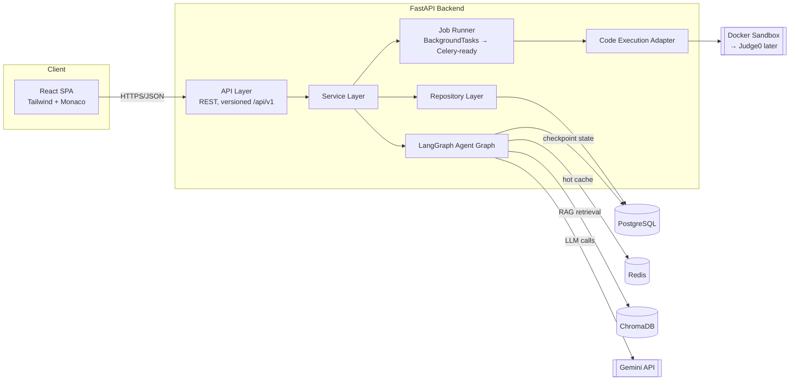
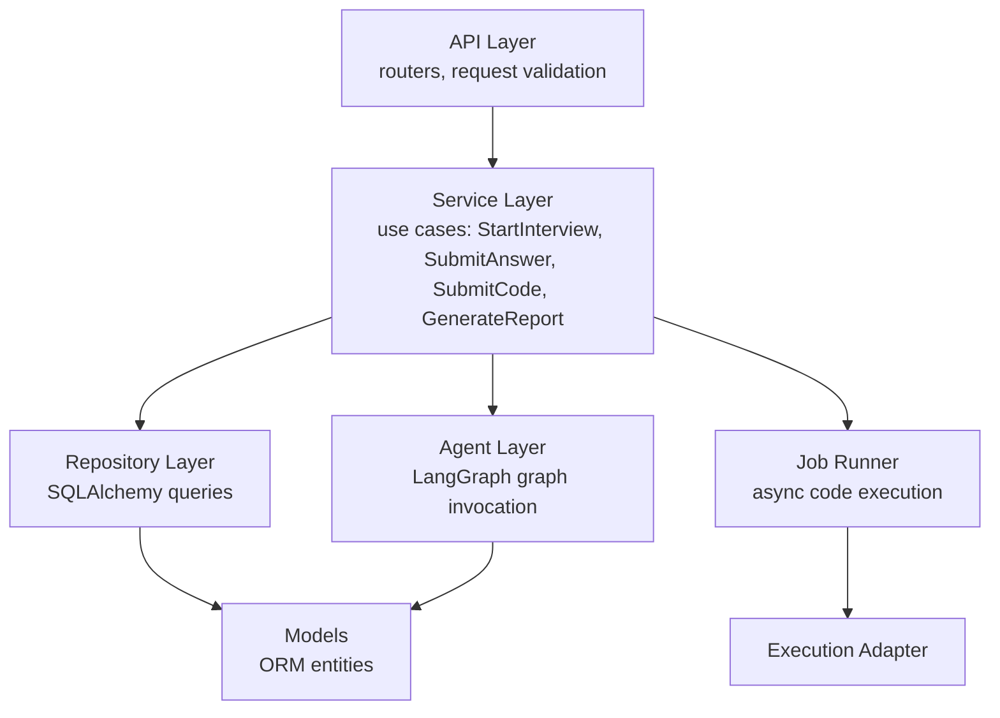
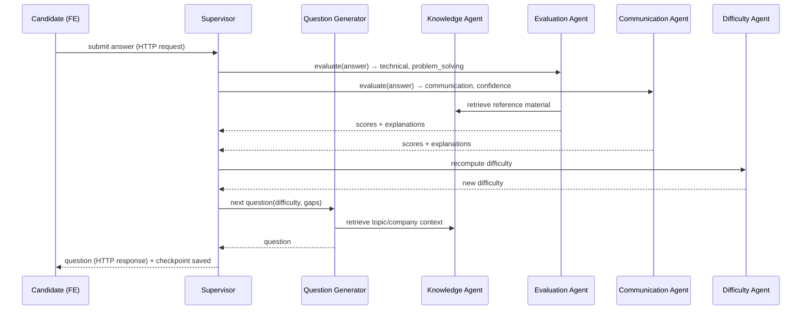
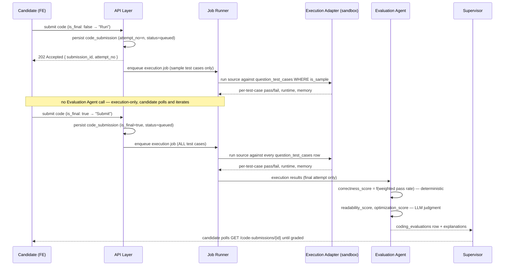
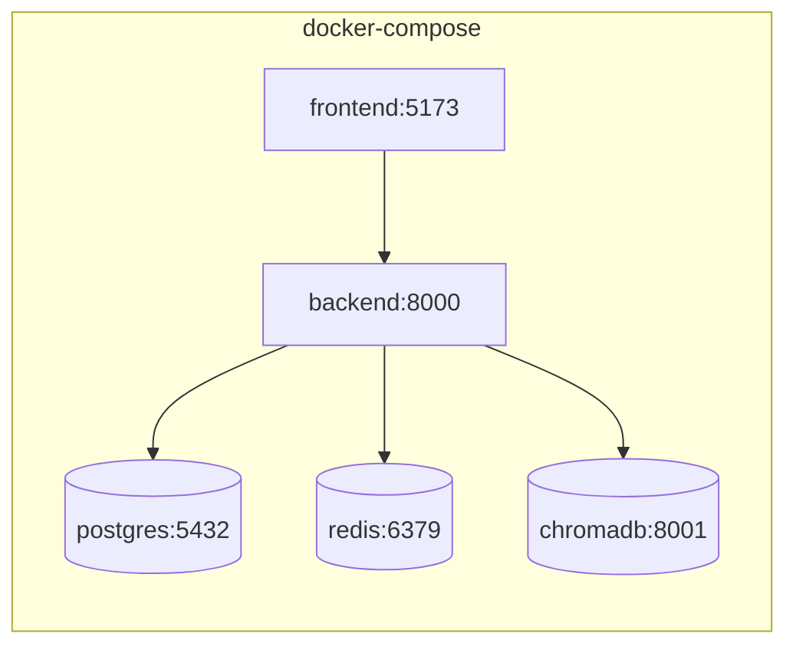

# InterviewIQ AI — System Architecture

Status: **Module 1 — locked pending final consistency pass**
Owner: Architecture module (Module 1)

This document defines the system architecture for InterviewIQ AI. [Database.md](Database.md) derives its entities from the domains defined here.

---

## 1. Design Goals

| Goal | Implication |
|---|---|
| Interviews must survive across HTTP requests | Interview state is a **resumable graph**, not in-memory session state |
| Multiple AI agents must collaborate, not just chain | Use an explicit orchestrator (Supervisor) over a shared state object, not a linear prompt pipeline |
| Difficulty adapts per-answer | Difficulty is a first-class piece of state, recalculated every turn, not just at report time |
| Resume must actually influence the interview | Resume-derived skills/gaps feed the Question Generator and Difficulty Agent as inputs, not just displayed in a report |
| Coding must be graded on real execution, not just LLM opinion | Candidate code runs against real test cases in a sandboxed executor; the LLM only judges what execution can't (readability, optimization) |
| Every module ships independently reviewable | Clean layering: API ⇄ Services ⇄ Agents/Repositories ⇄ Models. No layer reaches two levels down. |

---

## 2. High-Level System Diagram



**Why FastAPI is stateless but interviews aren't:** each candidate answer is a separate HTTP request. The LangGraph state machine for a given `interview_session` is checkpointed to Postgres after every node executes, keyed by `langgraph_thread_id`. The next request resumes the graph from that checkpoint rather than reconstructing context from scratch.

---

## 3. Monorepo Layout

```
InterviewIQ-AI/
├── backend/
│   ├── app/
│   │   ├── main.py
│   │   ├── core/              # config, security (JWT), logging, exceptions
│   │   ├── api/v1/            # FastAPI routers — thin, no business logic
│   │   ├── schemas/           # Pydantic request/response DTOs
│   │   ├── services/          # use-case orchestration, framework-agnostic
│   │   ├── agents/            # LangGraph nodes, graph definition, agent state
│   │   ├── execution/         # CodeExecutor interface + adapters (docker sandbox, judge0)
│   │   ├── jobs/               # JobRunner interface + adapters (BackgroundTasks, celery-ready)
│   │   ├── repositories/      # DB access, one per aggregate root
│   │   ├── models/            # SQLAlchemy ORM models
│   │   ├── db/                # session factory, Alembic migrations
│   │   ├── vectorstore/       # ChromaDB client wrapper
│   │   └── cache/             # Redis client wrapper
│   ├── tests/
│   ├── alembic/
│   ├── pyproject.toml
│   └── Dockerfile
├── frontend/
│   ├── src/
│   │   ├── app/                # routes / pages
│   │   ├── features/           # auth, resume, interview, dashboard, reports
│   │   │                        # each feature owns its own Zustand slice
│   │   ├── components/         # shared UI primitives
│   │   ├── lib/                 # api client, hooks
│   │   ├── store/               # Zustand store composition root only
│   │   └── editor/               # Monaco wrapper for coding rounds
│   └── Dockerfile
├── docs/
└── docker-compose.yml
```

**Rule:** `api/` never imports `repositories/` or `agents/` directly — it only calls `services/`. This keeps HTTP concerns out of business logic and makes services independently testable.

---

## 4. Backend Layering (Clean Architecture)



- **API layer**: FastAPI routers. Validates input, calls exactly one service method, returns a response schema. No SQL, no LLM calls, no execution logic here.
- **Service layer**: the use cases. Orchestrates repositories, agents, and the job runner. Owns transactions.
- **Agent layer**: LangGraph graph + nodes. Knows nothing about HTTP or raw SQL, only about repository/execution interfaces it's given.
- **Job Runner layer**: abstracts "run this later, possibly slowly" work (code execution, resume parsing/embeddings) behind one interface — see §8.1.
- **Repository layer**: one class per aggregate. Only place raw queries live.

---

## 5. Multi-Agent Interview Engine (LangGraph)

### 5.1 Agent Roster

| Agent | Responsibility | Produces |
|---|---|---|
| **Supervisor Agent** | Owns the graph. Decides round transitions, when to end the interview, routes control. | round/session transitions |
| **Question Generator Agent** | Produces the next question given role, company, difficulty, uncovered topics, resume context. | `questions` row |
| **Knowledge Agent** | RAG retrieval from ChromaDB — company patterns, canonical answers, topic reference material. Grounds question generation and evaluation. | retrieved context (not persisted) |
| **Interview Agent** | Manages conversational flow within a round (follow-ups, clarifying prompts). | conversational turns |
| **Evaluation Agent** | Scores **Technical** and **Problem Solving** for every answer. For coding questions, additionally invokes the Code Execution Adapter, then scores **Coding** correctness (execution-derived, not guessed), readability, and optimization. | `answer_evaluations`, `coding_evaluations` |
| **Communication Agent** | Scores **Communication** and **Confidence** — independent of technical correctness. | `answer_evaluations` fields |
| **Difficulty Agent** | Recomputes a rolling difficulty score after every answer; feeds it back into shared state for the next Question Generator call. | `answer_evaluations.difficulty_signal` |
| **Learning Agent** | Post-interview: maps weak areas to a learning roadmap. | `learning_roadmaps`, `roadmap_items` |
| **Report Agent** | Aggregates all evaluation output into the 5 report section scores (Technical, Coding, Communication, Problem Solving, Confidence) + overall score, each with an explanation. | `interview_reports`, `report_section_scores` |

Every score produced anywhere in this pipeline is stored with its explanation text alongside it — never a bare number. This is enforced at the schema level in [Database.md](Database.md) §6–7.

### 5.2 Shared Graph State

```
InterviewState {
  session_id, user_id
  resume_context: { skills, projects, gaps }
  company, role, current_round, current_difficulty
  conversation_history: [ ... ]
  last_question, last_answer
  running_scores: { technical, coding, communication, problem_solving, confidence }
  round_plan: [ ordered round types, from template_rounds ]
}
```

### 5.3 Turn-by-Turn Flow — Text Rounds (technical / behavioral / system design)



This turn is fully synchronous within one request — LLM calls only, no execution latency.

### 5.4 Turn-by-Turn Flow — Coding Round (asynchronous, Run vs. Submit)

Code execution is not instant, so the coding round cannot follow the synchronous request/response pattern above. It goes through the Job Runner. Every submission is one **attempt** (`code_submissions.attempt_no`); only the attempt marked `is_final` is graded — everything before that is a free "Run" against sample cases only, with no LLM involved:



`correctness_score` is **computed from test-case results, not from an LLM opinion** — the LLM only writes the human-readable explanation of *why* those results occurred. `readability_score` and `optimization_score` are the only LLM-judged numbers in this table, because execution alone can't measure them. This satisfies the "no LLM-only code evaluation" requirement structurally, not just by convention. Gating the Evaluation Agent (and its LLM calls) behind `is_final` also bounds LLM cost to exactly one evaluation per coding question, no matter how many times the candidate iterates.

### 5.5 Persistence of Agent State

- LangGraph checkpointer backed by **Postgres** — source of truth for `langgraph_thread_id`.
- **Redis** holds a hot read-through cache of the current turn's state for low-latency polling — never the source of truth.
- **ChromaDB** holds `question_bank`, `knowledge_base`, `resume_embeddings`.

---

## 6. Code Execution Subsystem

A pluggable execution boundary, because "how we run untrusted code" is exactly the kind of decision that should never leak into the agent/service logic that depends on it.

```python
class CodeExecutor(Protocol):
    def run(self, source_code: str, language: str, test_cases: list[TestCase]) -> list[TestCaseResult]: ...
```

| Backend | When | Notes |
|---|---|---|
| `DockerSandboxExecutor` | MVP | Spins one ephemeral, network-disabled container per submission from a small set of pinned language images. |
| `Judge0Executor` | Later, swap via config | Same interface, calls a self-hosted or managed Judge0 instance instead of local Docker. |

Selected via `CODE_EXECUTION_BACKEND=docker_sandbox|judge0` and dependency-injected — services and the Evaluation Agent only ever depend on the `CodeExecutor` protocol, never on a concrete backend. Swapping backends later is a config change, not a refactor.

**Sandbox security controls (MVP `DockerSandboxExecutor`):**
- `--network=none` — no outbound network access
- Hard CPU/memory/pids limits per run (`--memory`, `--cpus`, `--pids-limit`)
- Wall-clock timeout per test case, container killed on breach
- Read-only root filesystem; source code mounted read-only, scratch dir only for stdout/stderr capture
- One container per submission, destroyed immediately after

**MVP operational note:** running the sandbox from inside the `backend` container requires either Docker-outside-of-Docker (mount the host's `/var/run/docker.sock`) or a small sibling `execution-worker` service that exposes an internal HTTP endpoint the Job Runner calls. Deferred to the implementation module for this subsystem — flagged here so it isn't a surprise later.

---

## 7. Frontend Architecture

- **Feature-sliced** structure (`features/auth`, `features/resume`, `features/interview`, `features/dashboard`) — each owns its API calls, components, and local state.
- **Zustand**, one store slice per feature (`useAuthStore`, `useInterviewStore`, `useDashboardStore`...), composed at `store/index.ts`. No single monolithic global store — a feature never reaches into another feature's slice directly, it goes through that feature's exported hooks. Redux is not introduced unless a slice genuinely needs middleware/time-travel debugging that Zustand can't give us.
- **Monaco Editor** mounted only inside the coding round feature; submissions poll `GET /submissions/{id}` per §5.4 until graded.
- API client in `lib/` wraps fetch with auth token injection + refresh handling.

---

## 8. Cross-Cutting Concerns

### 8.1 Job Runner Abstraction

```python
class JobRunner(Protocol):
    def enqueue(self, job_name: str, payload: dict) -> str: ...  # returns job id
```

| Backend | When |
|---|---|
| `BackgroundTasksRunner` | MVP — wraps FastAPI's `BackgroundTasks`, runs in-process |
| `CeleryRunner` | Later — same interface, backed by Celery + Redis broker |

Used for: coding-round execution jobs (§5.4), resume parsing/embedding generation. Services depend on `JobRunner`, never on FastAPI's `BackgroundTasks` directly — this is what makes the Celery migration a config/DI change instead of a rewrite.

### 8.2 Other Concerns

| Concern | Approach |
|---|---|
| Auth | JWT access token (short-lived) + rotating refresh token (stored hashed in Postgres). Google OAuth via Authorization Code flow. |
| Config/secrets | `.env` per environment, loaded via Pydantic Settings; never committed. |
| Observability | Structured JSON logging from day one; defer full tracing/metrics stack until post-MVP. |
| Testing | Pytest for backend (services/agents tested with repositories and `CodeExecutor`/`JobRunner` mocked at the interface); Vitest + RTL for frontend. |

---

## 9. Deployment Topology (Docker Compose, local/dev)



The execution sandbox and (later) Celery worker are intentionally left off this diagram until the modules that implement them — adding them here now would lock in details (Docker-socket mount vs. sibling service) that §6 explicitly deferred.

---

## 10. Decisions Log

| # | Decision | Rationale |
|---|---|---|
| 1 | Frontend state: **Zustand**, one slice per feature | Less boilerplate than Redux for a single-team codebase; Redux only if a slice needs middleware Zustand can't provide |
| 2 | Background jobs: **FastAPI BackgroundTasks for MVP**, behind a `JobRunner` interface | Avoids standing up Celery/broker infra before it's needed, without blocking the later migration |
| 3 | Coding round: **real sandboxed execution against test cases**, LLM judges only readability/optimization | Correctness must be objectively verifiable, not LLM opinion; `CodeExecutor` interface keeps Judge0 swap-in cheap |
| 4 | Scoring: **0–100** scale, 5 named sections (Technical, Coding, Communication, Problem Solving, Confidence), every score paired with an explanation | Matches product's reporting taxonomy; enforced at schema level |
| 5 | Interview templates: **normalized relational schema** (`interview_templates` + `template_rounds`), not jsonb | Enables company-specific templates and per-round-type queries without JSON parsing |
| 6 | Code submissions are **multi-attempt** (`attempt_no`/`is_final`); only the final attempt is graded | Candidates need to test against sample cases before committing; gating LLM evaluation behind `is_final` bounds cost and keeps iterative "Run" fast |
| 7 | Interview plan snapshot: **`interview_rounds` stays normalized** (as decision #5 already established for `template_rounds`); a companion `interview_sessions.plan_snapshot` **JSONB** column carries only the denormalized company/role/template labels, difficulty-resolution reasons, and resume-derived personalization — never round order/weights (Module 4) | Round data needs per-round-type queries; label/personalization data is only ever read back whole, so normalizing it would just add snapshot tables with no query benefit. Keeps the "editing a template must never retroactively change a past plan" guarantee (decision reused from `interview_rounds`) without duplicating the whole domain into JSON |
| 8 | `app/services/interview/execution_context.py::build_execution_context()` is the sole Module 4 → Module 5 boundary, reading only `plan_snapshot` + `interview_rounds` (Module 4) | Mirrors Module 3's `app/services/resume/interview_context.py` seam. A LangGraph agent that only ever calls this one function is structurally unable to reach `companies`/`roles`/`interview_templates`/`resumes` directly — the "don't let agents query many unrelated repositories" principle enforced by construction, not convention |

---

*Next: [Database.md](Database.md) — schema derived from the domains above.*
