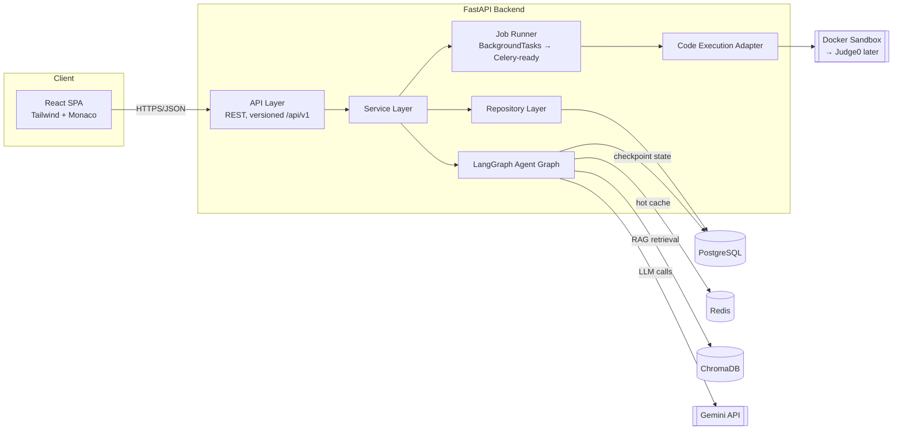
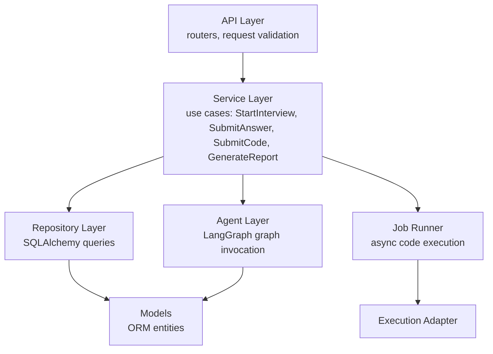
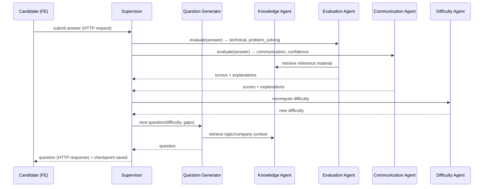
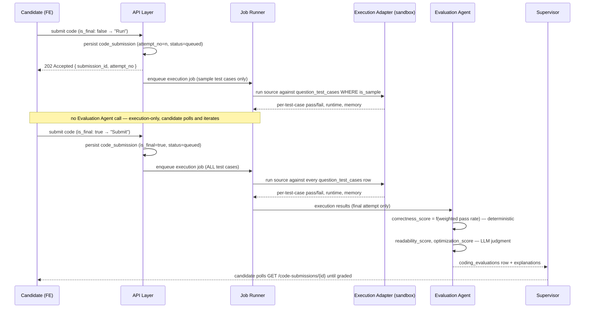
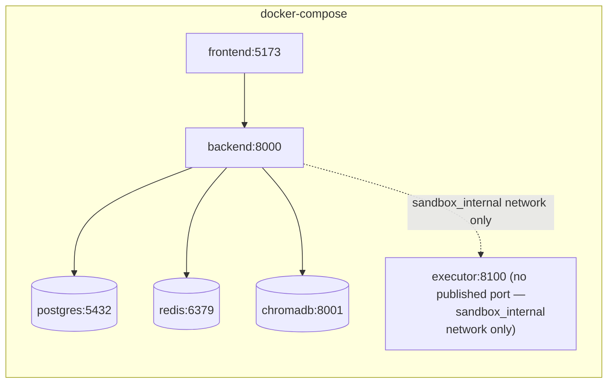

# InterviewIQ AI — System Architecture

Status: **Module 1 — locked pending final consistency pass**
Owner: Architecture module (Module 1)

This document defines the system architecture for InterviewIQ AI. [Database.md](Database.md) derives its entities from the domains defined here.

---

## 1. Design Goals

| Goal | Implication |
|---|---|
| Interviews must survive across HTTP requests | Interview state is a **resumable graph**, not in-memory session state |
| Multiple AI agents must collaborate, not just chain | Use an explicit orchestrator (Supervisor) over a shared state object, not a linear prompt pipeline |
| Difficulty adapts per-answer | Difficulty is a first-class piece of state, recalculated every turn, not just at report time |
| Resume must actually influence the interview | Resume-derived skills/gaps feed the Question Generator and Difficulty Agent as inputs, not just displayed in a report |
| Coding must be graded on real execution, not just LLM opinion | Candidate code runs against real test cases in a sandboxed executor; the LLM only judges what execution can't (readability, optimization) |
| Every module ships independently reviewable | Clean layering: API ⇄ Services ⇄ Agents/Repositories ⇄ Models. No layer reaches two levels down. |

---

## 2. High-Level System Diagram



**Why FastAPI is stateless but interviews aren't:** each candidate answer is a separate HTTP request. The LangGraph state machine for a given `interview_session` is checkpointed to Postgres after every node executes, keyed by `langgraph_thread_id`. The next request resumes the graph from that checkpoint rather than reconstructing context from scratch.

---

## 3. Monorepo Layout

```
InterviewIQ-AI/
├── backend/
│   ├── app/
│   │   ├── main.py
│   │   ├── core/              # config, security (JWT), logging, exceptions
│   │   ├── api/v1/            # FastAPI routers — thin, no business logic
│   │   ├── schemas/           # Pydantic request/response DTOs
│   │   ├── services/          # use-case orchestration, framework-agnostic
│   │   ├── agents/            # LangGraph nodes, graph definition, agent state
│   │   ├── execution/         # CodeExecutor interface + adapters (docker sandbox, judge0)
│   │   ├── jobs/               # JobRunner interface + adapters (BackgroundTasks, celery-ready)
│   │   ├── repositories/      # DB access, one per aggregate root
│   │   ├── models/            # SQLAlchemy ORM models
│   │   ├── db/                # session factory, Alembic migrations
│   │   ├── vectorstore/       # ChromaDB client wrapper
│   │   └── cache/             # Redis client wrapper
│   ├── tests/
│   ├── alembic/
│   ├── pyproject.toml
│   └── Dockerfile
├── frontend/
│   ├── src/
│   │   ├── app/                # routes / pages
│   │   ├── features/           # auth, resume, interview, dashboard, reports
│   │   │                        # each feature owns its own Zustand slice
│   │   ├── components/         # shared UI primitives
│   │   ├── lib/                 # api client, hooks
│   │   ├── store/               # Zustand store composition root only
│   │   └── editor/               # Monaco wrapper for coding rounds
│   └── Dockerfile
├── docs/
└── docker-compose.yml
```

**Rule:** `api/` never imports `repositories/` or `agents/` directly — it only calls `services/`. This keeps HTTP concerns out of business logic and makes services independently testable.

---

## 4. Backend Layering (Clean Architecture)



- **API layer**: FastAPI routers. Validates input, calls exactly one service method, returns a response schema. No SQL, no LLM calls, no execution logic here.
- **Service layer**: the use cases. Orchestrates repositories, agents, and the job runner. Owns transactions.
- **Agent layer**: LangGraph graph + nodes. Knows nothing about HTTP or raw SQL, only about repository/execution interfaces it's given.
- **Job Runner layer**: abstracts "run this later, possibly slowly" work (code execution, resume parsing/embeddings) behind one interface — see §8.1.
- **Repository layer**: one class per aggregate. Only place raw queries live.

---

## 5. Multi-Agent Interview Engine (LangGraph)

**Status (Module 5): §5.1–5.3 and §5.5 implemented for text rounds** (introduction, technical, behavioral, resume_discussion, system_design). **§5.4 (coding round) is now Module 6** — coding rounds execute for real (real sandboxed execution, real Run/Submit lifecycle); the round-selection and round-advancement mechanics are wired into the same LangGraph engine described here, while Run/Submit themselves are deliberately plain service calls outside the graph (§5.4 below explains why). Learning Agent and Report Agent (roster below) are Module 7, not built. See `app/agents/` (graph + nodes), `app/services/interview_intelligence/` (the Gemini-backed provider seam), `app/services/interview/execution_service.py` (text-round + round-advancement orchestration/persistence), and `app/services/coding/coding_round_service.py` (Module 6's Run/Submit orchestration) for the actual implementation, and backend/README.md's "Interview Engine (Module 5)" and "Coding Round & Code Execution (Module 6)" sections for the full design writeups including deviations from this section's original sketch, called out inline below.

### 5.1 Agent Roster

| Agent | Responsibility | Produces |
|---|---|---|
| **Supervisor Agent** | Owns the graph. Decides round transitions, when to end the interview, routes control. | round/session transitions |
| **Question Generator Agent** | Produces the next question given role, company, difficulty, uncovered topics, resume context. | `questions` row |
| **Knowledge Agent** | RAG retrieval from ChromaDB — company patterns, canonical answers, topic reference material. Grounds question generation and evaluation. | retrieved context (not persisted) |
| **Interview Agent** | Manages conversational flow within a round (follow-ups, clarifying prompts). | conversational turns |
| **Evaluation Agent** | Scores **Technical** and **Problem Solving** for every answer. For coding questions, additionally invokes the Code Execution Adapter, then scores **Coding** correctness (execution-derived, not guessed), readability, and optimization. | `answer_evaluations`, `coding_evaluations` |
| **Communication Agent** | Scores **Communication** and **Confidence** — independent of technical correctness. | `answer_evaluations` fields |
| **Difficulty Agent** | Recomputes a rolling difficulty score after every answer; feeds it back into shared state for the next Question Generator call. | `answer_evaluations.difficulty_signal` |
| **Learning Agent** | Post-interview: maps weak areas to a learning roadmap. | `learning_roadmaps`, `roadmap_items` |
| **Report Agent** | Aggregates all evaluation output into the 5 report section scores (Technical, Coding, Communication, Problem Solving, Confidence) + overall score, each with an explanation. | `interview_reports`, `report_section_scores` |

Every score produced anywhere in this pipeline is stored with its explanation text alongside it — never a bare number. This is enforced at the schema level in [Database.md](Database.md) §6–7.

**Implementation note (Module 5):** the Knowledge Agent is not a ChromaDB RAG lookup for MVP — it's a deterministic in-process helper (resume evidence already surfaced by Module 3 + `role_profiles.json` topic hints), not a graph node at all (see `app/agents/nodes/knowledge.py`'s docstring for why: no LLM call, no I/O, cheap enough to be a plain function other nodes call inline). This is a real, documented seam a future RAG implementation can satisfy without touching callers — not a placeholder pretending to be the real thing.

### 5.2 Shared Graph State

```
InterviewState {
  session_id, user_id
  resume_context: { skills, projects, gaps }
  company, role, current_round, current_difficulty
  conversation_history: [ ... ]
  last_question, last_answer
  running_scores: { technical, coding, communication, problem_solving, confidence }
  round_plan: [ ordered round types, from template_rounds ]
}
```

**As actually implemented** (`app/agents/state.py::InterviewState`) — the same shape, refined: `conversation_history`/`running_scores` became `question_history`/`answer_history` (scoped to the *current round only* — durable full history lives in Postgres, module §3's "do not put enormous duplicated documents into graph state") and `interview_scores` (a running average, display-only, not the report's source of truth); explicit `previous_difficulty` alongside `current_difficulty` so a response can show the transition without a second read; `follow_up_count` for Module 5's follow-up cap (§8); a `trigger` (`START`/`SUBMIT_ANSWER`/`CODING_ROUND_COMPLETE` — the third added by Module 6, §5.4 below) driving deterministic routing instead of relying on LangGraph's `interrupt()`/`Command(resume=...)` (see the Decisions Log entry below for why). Module 6 additionally added `role_key` (role-priority matching for coding-problem selection), `coding_problem_candidates` (the small precomputed catalog candidate list `select_coding_problem_node` picks from — never a DB query from inside a node), and `coding_problem_history` (whole-interview repeat avoidance across multiple coding rounds, unlike the per-round `question_history`). `rounds_to_skip` — Module 5's placeholder for "a coding round was skipped, not executed" — was removed outright once Module 6 made coding rounds real; nothing produces it anymore. Every field carries a one-line "why this exists" comment in the source.

### 5.3 Turn-by-Turn Flow — Text Rounds (technical / behavioral / system design)



This turn is fully synchronous within one request — LLM calls only, no execution latency. **As implemented**, the LLM-call shape differs slightly for cost control (module §23's explicit call-budget instruction, verified live against real Gemini — see backend/README.md): Evaluation Agent and Communication Agent are each exactly one call (technical+problem_solving together; communication+confidence together), Difficulty Agent and the Supervisor's routing are pure Python (zero calls), and exactly one generation call fires per turn — Question Generator **or** Interview Agent (follow-up) **or** neither, if the interview just completed — never both. Budget: 2–3 Gemini calls per answer, 1 call for `/start`.

### 5.4 Turn-by-Turn Flow — Coding Round (asynchronous, Run vs. Submit)

Code execution is not instant, so the coding round cannot follow the synchronous request/response pattern above. It goes through the Job Runner. Every submission is one **attempt** (`code_submissions.attempt_no`); only the attempt marked `is_final` is graded — everything before that is a free "Run" against sample cases only, with no LLM involved:



`correctness_score` is **computed from test-case results, not from an LLM opinion** — the LLM only writes the human-readable explanation of *why* those results occurred. `readability_score` and `optimization_score` are the only LLM-judged numbers in this table, because execution alone can't measure them. This satisfies the "no LLM-only code evaluation" requirement structurally, not just by convention. Gating the Evaluation Agent (and its LLM calls) behind `is_final` also bounds LLM cost to exactly one evaluation per coding question, no matter how many times the candidate iterates.

**As implemented (Module 6)** — the diagram above is accurate for Run/Submit itself, with three refinements:
- **Problem selection is a graph node, execution is not.** Reaching a coding round (at `/start` or via round transition) still goes through the LangGraph engine exactly like a text round — a `select_coding_problem_node` deterministically picks one catalog problem (never an LLM call — module §8/§15's "even selection shouldn't depend on an LLM being reliable") and the service snapshots it into a `Question` + `QuestionTestCase` rows, the same "id assigned after persistence" pattern `question_generator_node` uses. Run/Submit themselves are deliberately **plain `CodingRoundService` calls, never graph turns** — a different shape entirely (async, polled, multi-attempt) from a synchronous one-shot text-answer turn, and the reason `EvaluationAgent` above is written as "Job Runner → Execution Adapter → Evaluation Agent" rather than "Supervisor → Evaluation Agent": nothing about grading a submission needs the Supervisor's turn-taking machinery.
- **Real execution is one HTTP call to a sibling container**, not an in-process "Execution Adapter" — see §6 below, which resolves this document's earlier "deferred to the implementation module" note.
- **Round advancement re-enters the graph.** Once a *final* submission is genuinely graded (a real terminal outcome — success, partial, or one of the granular failure statuses in §11 below — never a bare infra error, see backend/README.md's Module 6 section for that distinction), the job that graded it calls `InterviewExecutionService.complete_coding_round(...)`, which invokes the graph with a new `CODING_ROUND_COMPLETE` trigger. That trigger routes straight to the existing `round_transition` node — no `evaluate_answer`/`adapt_difficulty` (a coding round has no free-text answer or difficulty signal of its own) — exactly mirroring the tail of a text round's `NEXT_ROUND` path, which `InterviewExecutionService._apply_round_transition_result` now shares between both callers instead of duplicating it.

### 5.5 Persistence of Agent State

- LangGraph checkpointer backed by **Postgres** — source of truth for `langgraph_thread_id`.
- **Redis** holds a hot read-through cache of the current turn's state for low-latency polling — never the source of truth.
- **ChromaDB** holds `question_bank`, `knowledge_base`, `resume_embeddings`.

**As implemented (Module 5):** the LangGraph Postgres checkpointer is real and verified working (`app/agents/checkpointer.py` — confirmed live by querying `checkpoints` after a real multi-turn interview; see Database.md §9). But `InterviewExecutionService` treats **Postgres tables, not the checkpoint, as the sole recoverability guarantee** — it rebuilds a complete `InterviewState` from `interview_sessions`/`interview_rounds`/`questions`/`answers`/`answer_evaluations` at the start of every turn rather than resuming a checkpointed mid-turn state, so "stop and resume later" (module §5/§6) works via the idempotent-retry design in `submit_answer` (an `Answer` row is durably committed *before* any LLM call), not via LangGraph's own resume mechanics. The Redis hot-state cache (`session:{id}:hot_state`) was not implemented — `GET .../current-turn` reads Postgres directly, fast enough at MVP scale. `question_bank`/`knowledge_base` were not implemented — see §5.1's Knowledge Agent note above.

---

## 6. Code Execution Subsystem

A pluggable execution boundary, because "how we run untrusted code" is exactly the kind of decision that should never leak into the agent/service logic that depends on it.

```python
class CodeExecutor(Protocol):
    async def run(self, *, source_code: str, language: str, test_cases: list[TestCase]) -> ExecutionOutcome: ...
```

**Status (Module 6): implemented and live-verified.** This section's original sketch deferred the "how does the sandbox actually run relative to `backend`" question (see the old MVP operational note, replaced below) to this module — resolved as a **dedicated sibling `executor` container**, never a Docker-socket mount, anywhere, by any component (module §4's explicit prohibition list treats socket access as absolute).

| Backend | When | Notes |
|---|---|---|
| `DockerSandboxExecutor` | MVP, implemented | Despite the name, never touches the Docker API/socket directly — makes a plain HTTP call (`httpx`) to the sibling `executor` container described below. The name is kept only for continuity with `CODE_EXECUTION_BACKEND=docker_sandbox`. |
| `Judge0Executor` | Not built | Same `CodeExecutor` interface would let this swap in later via config; no code depends on `DockerSandboxExecutor` specifically. |
| `FakeCodeExecutor` | Tests only | Deterministic, magic-marker-driven (`app/execution/fake_executor.py`); rejected outright in `ENVIRONMENT=production` by `build_code_executor`'s guard. |

Selected via `CODE_EXECUTION_BACKEND=docker_sandbox|fake` and dependency-injected — `CodingRoundService` and the background grading job only ever depend on the `CodeExecutor` protocol, never on a concrete backend.

**Sandbox architecture, as actually built** — layered, and documented precisely rather than overclaimed (module §18's "do not claim a security property that has not actually been tested" — every layer below was verified against the real running container, see `tests/test_sandbox_security.py` and backend/README.md's "What was actually verified" section, not just read and assumed correct):

1. **Container/network boundary** (the strong layer, kernel/Docker-enforced): `executor` sits on a Compose network with `internal: true` — Docker refuses to route that network anywhere outside the Compose project, so the container has no path to the internet or the host, full stop, regardless of anything a sandboxed subprocess inside it tries. `backend` is the only other service on that network.
2. **Container hardening** (also kernel/Docker-enforced): `read_only: true` root filesystem with a size-capped `tmpfs` at `/tmp` as the only writable path, `cap_drop: [ALL]`, `security_opt: [no-new-privileges:true]`, a non-root user baked into the image. No `env_file`, no secret environment variables, no project source, no `.env` ever reach this container — it is built from its own minimal image (`backend/execution_worker/`) that imports nothing from `app/`.
3. **Per-execution OS-level limits** (process-level — the layer that is honestly *not* container-per-execution): each submission runs as a subprocess inside `executor`, under `resource.setrlimit` (CPU seconds, address-space/memory, process count), a wall-clock `subprocess` timeout that SIGKILLs the whole process group (a forked grandchild would otherwise survive killing just the direct child), and a byte cap on captured stdout/stderr enforced via `RLIMIT_FSIZE` on redirected output *files* — not "capture everything then truncate," which would let an output bomb exhaust the executor's own memory first. Every execution gets a fresh `tempfile.TemporaryDirectory()`, deleted on every exit path.
4. **Documented limitation, not hidden:** concurrent submissions share the `executor` container's kernel/process table — this is process isolation *within* one locked-down, network-isolated, read-only-root-filesystem container, not a fresh container (or VM) per execution. Genuinely isolated from the main app, genuinely resource-limited, genuinely network-isolated — but not the stronger "container-per-run" guarantee. A `RLIMIT_NPROC` caveat in the same spirit: since the FastAPI server and every sandboxed subprocess share one uid, it's fork-bomb mitigation, not a hard per-execution guarantee.

Comparison against expected output happens in `backend`'s `DockerSandboxExecutor`, never inside `executor` — `executor` is asked to run code against raw stdin and report what happened (stdout/stderr/exit code/timing/timeout/truncation flags); it is never told a test case's expected answer, so a hidden test's answer never needs to cross into the sandbox at all.

---

## 7. Frontend Architecture

- **Feature-sliced** structure (`features/auth`, `features/resume`, `features/interview`, `features/dashboard`) — each owns its API calls, components, and local state.
- **Zustand**, one store slice per feature (`useAuthStore`, `useInterviewStore`, `useDashboardStore`...), composed at `store/index.ts`. No single monolithic global store — a feature never reaches into another feature's slice directly, it goes through that feature's exported hooks. Redux is not introduced unless a slice genuinely needs middleware/time-travel debugging that Zustand can't give us.
- **Monaco Editor** mounted only inside the coding round feature; submissions poll `GET /submissions/{id}` per §5.4 until graded.
- API client in `lib/` wraps fetch with auth token injection + refresh handling.

---

## 8. Cross-Cutting Concerns

### 8.1 Job Runner Abstraction

```python
class JobRunner(Protocol):
    def enqueue(self, job_name: str, payload: dict) -> str: ...  # returns job id
```

| Backend | When |
|---|---|
| `BackgroundTasksRunner` | MVP — wraps FastAPI's `BackgroundTasks`, runs in-process |
| `CeleryRunner` | Later — same interface, backed by Celery + Redis broker |

Used for: coding-round execution jobs (§5.4), resume parsing/embedding generation. Services depend on `JobRunner`, never on FastAPI's `BackgroundTasks` directly — this is what makes the Celery migration a config/DI change instead of a rewrite.

### 8.2 Other Concerns

| Concern | Approach |
|---|---|
| Auth | JWT access token (short-lived) + rotating refresh token (stored hashed in Postgres). Google OAuth via Authorization Code flow. |
| Config/secrets | `.env` per environment, loaded via Pydantic Settings; never committed. |
| Observability | Structured JSON logging from day one; defer full tracing/metrics stack until post-MVP. |
| Testing | Pytest for backend (services/agents tested with repositories and `CodeExecutor`/`JobRunner` mocked at the interface); Vitest + RTL for frontend. |

---

## 9. Deployment Topology (Docker Compose, local/dev)



**Status (Module 6): the execution sandbox is implemented — `executor` is real, on the diagram now.** It sits on its own `sandbox_internal` Compose network (`internal: true` — no route to the internet or host, see §6), which only `backend` also joins; `executor` publishes no port to the host at all, unlike every other service here. The (later) Celery worker is still intentionally left off this diagram until the module that implements it.

---

## 10. Decisions Log

| # | Decision | Rationale |
|---|---|---|
| 1 | Frontend state: **Zustand**, one slice per feature | Less boilerplate than Redux for a single-team codebase; Redux only if a slice needs middleware Zustand can't provide |
| 2 | Background jobs: **FastAPI BackgroundTasks for MVP**, behind a `JobRunner` interface | Avoids standing up Celery/broker infra before it's needed, without blocking the later migration |
| 3 | Coding round: **real sandboxed execution against test cases**, LLM judges only readability/optimization | Correctness must be objectively verifiable, not LLM opinion; `CodeExecutor` interface keeps Judge0 swap-in cheap |
| 4 | Scoring: **0–100** scale, 5 named sections (Technical, Coding, Communication, Problem Solving, Confidence), every score paired with an explanation | Matches product's reporting taxonomy; enforced at schema level |
| 5 | Interview templates: **normalized relational schema** (`interview_templates` + `template_rounds`), not jsonb | Enables company-specific templates and per-round-type queries without JSON parsing |
| 6 | Code submissions are **multi-attempt** (`attempt_no`/`is_final`); only the final attempt is graded | Candidates need to test against sample cases before committing; gating LLM evaluation behind `is_final` bounds cost and keeps iterative "Run" fast |
| 7 | Interview plan snapshot: **`interview_rounds` stays normalized** (as decision #5 already established for `template_rounds`); a companion `interview_sessions.plan_snapshot` **JSONB** column carries only the denormalized company/role/template labels, difficulty-resolution reasons, and resume-derived personalization — never round order/weights (Module 4) | Round data needs per-round-type queries; label/personalization data is only ever read back whole, so normalizing it would just add snapshot tables with no query benefit. Keeps the "editing a template must never retroactively change a past plan" guarantee (decision reused from `interview_rounds`) without duplicating the whole domain into JSON |
| 8 | `app/services/interview/execution_context.py::build_execution_context()` is the sole Module 4 → Module 5 boundary, reading only `plan_snapshot` + `interview_rounds` (Module 4) | Mirrors Module 3's `app/services/resume/interview_context.py` seam. A LangGraph agent that only ever calls this one function is structurally unable to reach `companies`/`roles`/`interview_templates`/`resumes` directly — the "don't let agents query many unrelated repositories" principle enforced by construction, not convention |
| 9 | Interview graph: **one `ainvoke()` per HTTP request**, driven by an explicit `trigger` field, not LangGraph's `interrupt()`/`Command(resume=...)` (Module 5) | The pinned `langgraph==0.2.76` interrupt API was newer/less battle-tested at the time; a full-state-in, full-state-out invocation per turn maps directly onto API.md's documented "synchronous, returns evaluation + next question" contract and keeps recoverability entirely in Postgres (decision #10), not dependent on resuming a specific graph node |
| 10 | Recoverability for "stop mid-question, resume later" comes from **Postgres + idempotent retry**, not from resuming a LangGraph checkpoint (Module 5) | `InterviewExecutionService` rebuilds `InterviewState` fresh from `interview_sessions`/`interview_rounds`/`questions`/`answers` every turn; the LangGraph Postgres checkpointer is real and verified working (Database.md §9) but is defense-in-depth, not the load-bearing recovery mechanism — simpler to reason about and test than mid-node graph resume, and already sufficient for the stated requirement |
| 11 | Adaptive difficulty is a **pure deterministic function** of `technical_score`/`problem_solving_score` (`app/agents/policy.py`), never LLM-proposed (Module 5) | `>=80` increase / `<=40` decrease / else maintain, clamped at `easy`/`hard`. The wide 40–80 dead zone is the anti-oscillation mechanism. Matches the explicit instruction that an LLM must never freely decide difficulty |
| 12 | Follow-up decision (FOLLOW_UP/NEXT_QUESTION/NEXT_ROUND/COMPLETE) is the Supervisor's **deterministic threshold logic** over a structured `follow_up_worthy` flag the Evaluation Agent sets; only the follow-up's *question text* is LLM-generated (Module 5) | Keeps "should we probe deeper" auditable and bounded (`MAX_FOLLOW_UPS_PER_QUESTION`) without an LLM choosing its own graph transition |
| 13 | Round length (target question count per round type) is a **Module-5-owned policy constant** (`app/agents/policy.py::DEFAULT_QUESTIONS_PER_ROUND`), not a `template_rounds` column (Module 5) | Module 4's schema (approved, not reopened) has no such column; treating round length as an execution-engine policy rather than a plan attribute avoids touching an already-shipped table for a Module 5-only need |
| 14 | Sandbox: a **dedicated sibling `executor` container**, never a Docker-socket mount, by any component (Module 6, resolves §6's originally-deferred choice) | The task's prohibition list treats socket access as absolute; zero components having it is the only reading defensible without qualification. `internal: true` on its own Compose network gives a genuinely kernel-enforced no-egress guarantee a socket-mount design couldn't match |
| 15 | Coding-problem selection is a **LangGraph node** (`select_coding_problem_node`), but Run/Submit are **plain service calls outside the graph** (Module 6) | Selecting a problem is a turn-shaped decision the existing Supervisor/round-transition machinery already handles for text rounds; Run/Submit are async, polled, multi-attempt — a fundamentally different shape nothing about the graph's turn-taking model fits |
| 16 | `coding_evaluations.overall_code_score` is a **deterministic weighted combination** of the sub-scores (`app/agents/policy.py::compute_overall_code_score`), never LLM-set (Module 6) | Extends decision #3's "LLM judges only readability/optimization" principle to the headline aggregate number too — the model is never asked to pick it |
| 17 | `code_submissions.is_final` can be **released back to `false`**, but only on a genuine sandbox/evaluation-provider infrastructure failure, never on any candidate-caused outcome (Module 6) | The partial unique index enforces "at most one final submission" — without a release path, a transient infra outage would permanently lock a candidate out of ever submitting again for a question that was never actually graded |

---

*Next: [Database.md](Database.md) — schema derived from the domains above.*
