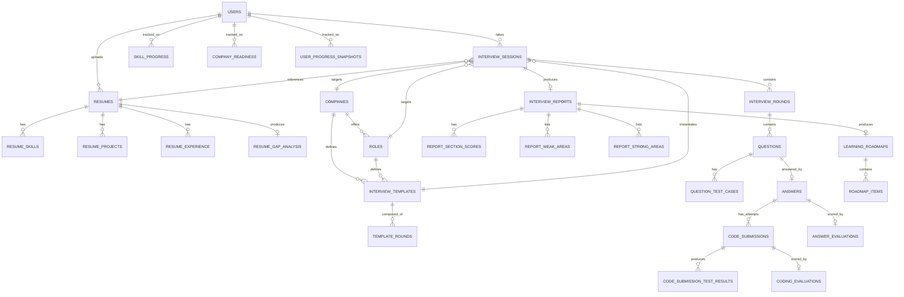

# InterviewIQ AI — Database Schema

Status: **Module 1 — locked pending final consistency pass**
Owner: Database module (Module 1)

Schema for PostgreSQL (system of record). Redis and ChromaDB usage are documented at the bottom — they hold derived/cache/vector data, never the source of truth for anything in this document.

See [Architecture.md](Architecture.md) for the domains this schema implements.

---

## 0. Conventions

- Primary keys: `UUID` (`gen_random_uuid()`), not serial ints.
- Every table has `created_at timestamptz default now()`. Tables mutated after creation also get `updated_at`.
- Enums implemented as Postgres `ENUM` types, named `<table>_<column>_enum`.
- Foreign keys `ON DELETE CASCADE` only where the child has no meaning without the parent. Everywhere else, `ON DELETE RESTRICT`.
- No soft-delete by default — only `users` gets `deleted_at`. Interview history is a permanent record, not user-editable.
- **All scores are `numeric(5,2)` on a 0–100 scale.** Every score column is paired with a `..._explanation text not null` column, or lives in a table whose sole purpose is score+explanation pairs. No bare numeric score is ever stored without its explanation.

---

## 1. Entity Relationship Overview

---

## 2. Auth Domain

### `users`

| Column | Type | Constraints |
|---|---|---|
| id | uuid | PK |
| email | text | unique, not null |
| password_hash | text | nullable (null if OAuth-only account) |
| full_name | text | not null |
| avatar_url | text | nullable |
| auth_provider | enum(`local`,`google`) | not null |
| google_id | text | unique, nullable |
| role | enum(`candidate`,`recruiter`,`admin`) | not null, default `candidate` |
| is_active | boolean | not null, default true |
| is_verified | boolean | not null, default false |
| deleted_at | timestamptz | nullable |
| created_at | timestamptz | not null |
| updated_at | timestamptz | not null |

### `refresh_tokens`

| Column | Type | Constraints |
|---|---|---|
| id | uuid | PK |
| user_id | uuid | FK → users.id, cascade |
| token_hash | text | not null, unique |
| expires_at | timestamptz | not null |
| revoked_at | timestamptz | nullable |
| created_at | timestamptz | not null |

Index: `(user_id)`, `(token_hash)`.

---

## 3. Resume Domain

### `resumes`

| Column | Type | Constraints |
|---|---|---|
| id | uuid | PK |
| user_id | uuid | FK → users.id, cascade |
| file_url | text | not null |
| original_filename | text | not null |
| parsed_status | enum(`pending`,`processing`,`done`,`failed`) | not null, default `pending` |
| raw_text | text | nullable |
| created_at | timestamptz | not null |

### `resume_skills`

| Column | Type | Constraints |
|---|---|---|
| id | uuid | PK |
| resume_id | uuid | FK → resumes.id, cascade |
| skill_name | text | not null |
| proficiency_hint | enum(`beginner`,`intermediate`,`advanced`) | nullable |
| source | enum(`explicit`,`inferred`) | not null |

Index: `(resume_id)`, `(skill_name)`.

### `resume_projects`

| Column | Type | Constraints |
|---|---|---|
| id | uuid | PK |
| resume_id | uuid | FK → resumes.id, cascade |
| title | text | not null |
| description | text | nullable |
| technologies | jsonb | not null, default `[]` |
| start_date | date | nullable |
| end_date | date | nullable |

### `resume_experience`

| Column | Type | Constraints |
|---|---|---|
| id | uuid | PK |
| resume_id | uuid | FK → resumes.id, cascade |
| company | text | not null |
| title | text | not null |
| description | text | nullable |
| start_date | date | nullable |
| end_date | date | nullable |

### `resume_gap_analysis`

| Column | Type | Constraints |
|---|---|---|
| id | uuid | PK |
| resume_id | uuid | FK → resumes.id, cascade |
| target_role_id | uuid | FK → roles.id, nullable |
| missing_skills | jsonb | not null, default `[]` |
| recommended_difficulty | enum(`easy`,`medium`,`hard`) | not null |
| generated_at | timestamptz | not null |

---

## 4. Interview Planning Domain

### `companies`

| Column | Type | Constraints |
|---|---|---|
| id | uuid | PK |
| name | text | not null |
| slug | text | unique, not null |
| logo_url | text | nullable |
| interview_style_notes | text | nullable — grounding context fed to Question Generator Agent |
| created_at | timestamptz | not null |

### `roles`

| Column | Type | Constraints |
|---|---|---|
| id | uuid | PK |
| company_id | uuid | FK → companies.id, nullable (null = generic/company-agnostic role) |
| title | text | not null |
| level | enum(`intern`,`junior`,`mid`,`senior`,`staff`) | not null |
| description | text | nullable |

### `interview_templates`

A named, reusable round plan. A single (company, role) pair can have multiple templates (e.g. "Google SWE — Onsite Loop" vs "Google SWE — Phone Screen"), which is the flexibility explicitly required for company-specific templates.

| Column | Type | Constraints |
|---|---|---|
| id | uuid | PK |
| company_id | uuid | FK → companies.id, nullable |
| role_id | uuid | FK → roles.id, not null |
| name | text | not null — e.g. "Onsite Loop", "Phone Screen" |
| description | text | nullable |
| default_difficulty | enum(`easy`,`medium`,`hard`) | not null |
| is_active | boolean | not null, default true |
| created_at | timestamptz | not null |

### `template_rounds`

Normalized round plan — replaces the earlier `rounds jsonb` design. Each row is one round slot in a template.

| Column | Type | Constraints |
|---|---|---|
| id | uuid | PK |
| template_id | uuid | FK → interview_templates.id, cascade |
| round_type | enum(`introduction`,`technical`,`coding`,`behavioral`,`system_design`,`resume_discussion`,`final`) | not null |
| sequence_no | int | not null |
| weight | numeric(4,2) | not null — contribution to overall score, e.g. `0.30` |
| is_required | boolean | not null, default true |
| difficulty_override | enum(`easy`,`medium`,`hard`) | nullable — overrides template default for this round only |

Unique: `(template_id, sequence_no)`. Index: `(template_id, round_type)` — supports "which templates include a coding round" queries.

---

## 5. Interview Execution Domain

### `interview_sessions`

The aggregate root for a single interview attempt.

| Column | Type | Constraints |
|---|---|---|
| id | uuid | PK |
| user_id | uuid | FK → users.id, restrict |
| resume_id | uuid | FK → resumes.id, restrict |
| company_id | uuid | FK → companies.id, nullable |
| role_id | uuid | FK → roles.id, not null |
| template_id | uuid | FK → interview_templates.id, restrict |
| status | enum(`not_started`,`in_progress`,`completed`,`abandoned`) | not null, default `not_started` |
| current_round_sequence | int | not null, default 0 |
| current_difficulty | enum(`easy`,`medium`,`hard`) | not null |
| langgraph_thread_id | text | unique, not null — links to LangGraph checkpoint |
| started_at | timestamptz | nullable |
| completed_at | timestamptz | nullable |
| created_at | timestamptz | not null |

Index: `(user_id, status)` for dashboard "in-progress interviews" queries.

### `interview_rounds`

One row per round *instance* within a session. `weight` and `planned_difficulty` are **snapshotted** from `template_rounds` at session-creation time — if the template is edited later, past sessions' reports must not silently change.

| Column | Type | Constraints |
|---|---|---|
| id | uuid | PK |
| session_id | uuid | FK → interview_sessions.id, cascade |
| template_round_id | uuid | FK → template_rounds.id, restrict — traceability back to the plan |
| round_type | enum(same as template_rounds) | not null |
| sequence_no | int | not null |
| weight | numeric(4,2) | not null — snapshot copy |
| planned_difficulty | enum(`easy`,`medium`,`hard`) | not null — snapshot copy |
| status | enum(`pending`,`active`,`completed`,`skipped`) | not null, default `pending` |
| started_at | timestamptz | nullable |
| completed_at | timestamptz | nullable |

Unique: `(session_id, sequence_no)`.

### `questions`

| Column | Type | Constraints |
|---|---|---|
| id | uuid | PK |
| round_id | uuid | FK → interview_rounds.id, cascade |
| topic | text | not null |
| difficulty | enum(`easy`,`medium`,`hard`) | not null |
| question_text | text | not null |
| question_type | enum(`mcq`,`open`,`coding`,`system_design`) | not null |
| reference_answer | text | nullable — from Knowledge Agent retrieval, used only for evaluation grounding |
| source | enum(`bank`,`generated`) | not null |
| vector_ref | text | nullable — ChromaDB doc id if sourced from `question_bank` |
| asked_at | timestamptz | not null |

Index: `(round_id)`.

### `question_test_cases`

Only populated for `question_type = coding`. Backs the real execution engine — this is what `CodeExecutor` runs the candidate's code against.

| Column | Type | Constraints |
|---|---|---|
| id | uuid | PK |
| question_id | uuid | FK → questions.id, cascade |
| input | text | not null |
| expected_output | text | not null |
| is_sample | boolean | not null, default false — sample cases are shown to the candidate, hidden ones are not |
| weight | numeric(4,2) | not null, default `1.00` — contribution to correctness_score |
| sequence_no | int | not null |

Unique: `(question_id, sequence_no)`.

### `answers`

One per question — for coding questions this holds the candidate's verbal/text approach explanation (if any); the code itself lives in `code_submissions`.

| Column | Type | Constraints |
|---|---|---|
| id | uuid | PK |
| question_id | uuid | FK → questions.id, cascade, unique |
| answer_text | text | nullable |
| response_time_seconds | int | nullable |
| submitted_at | timestamptz | not null |

### `code_submissions`

One row per **attempt**, not per question — a candidate may "Run" against sample test cases any number of times before the one "Submit" that counts. `is_final` marks that one graded attempt.

| Column | Type | Constraints |
|---|---|---|
| id | uuid | PK |
| answer_id | uuid | FK → answers.id, cascade |
| attempt_no | int | not null — 1, 2, 3... per answer, assigned server-side |
| is_final | boolean | not null, default false |
| language | text | not null |
| source_code | text | not null |
| execution_status | enum(`queued`,`running`,`success`,`partial`,`error`,`timeout`) | not null, default `queued` |
| executor | text | nullable — e.g. `docker_sandbox_v1`, `judge0`, for audit/debugging |
| passed_test_count | int | nullable — populated once executed |
| total_test_count | int | nullable |
| total_runtime_ms | int | nullable |
| peak_memory_kb | int | nullable |
| created_at | timestamptz | not null |
| graded_at | timestamptz | nullable — set only when `is_final = true` and full evaluation has run |

Unique: `(answer_id, attempt_no)`. Partial unique index `(answer_id) WHERE is_final` — at most one final attempt per answer.

**Scope of execution differs by attempt type:**
- `is_final = false` ("Run"): executes only against `question_test_cases WHERE is_sample = true`. No `coding_evaluations` row is produced — execution only, no LLM call. This keeps iterative testing fast and free of LLM cost.
- `is_final = true` ("Submit"): executes against **all** test cases (sample + hidden), and is the only attempt that produces a `coding_evaluations` row.

### `code_submission_test_results`

Per-test-case execution detail — the deterministic evidence behind `coding_evaluations.correctness_score`.

| Column | Type | Constraints |
|---|---|---|
| id | uuid | PK |
| code_submission_id | uuid | FK → code_submissions.id, cascade |
| test_case_id | uuid | FK → question_test_cases.id, restrict |
| passed | boolean | not null |
| actual_output | text | nullable |
| runtime_ms | int | nullable |
| memory_kb | int | nullable |
| stderr | text | nullable |

Unique: `(code_submission_id, test_case_id)`.

---

## 6. Evaluation Domain

### `answer_evaluations`

Produced by the Evaluation Agent (technical, problem_solving) and Communication Agent (communication, confidence) for **every** answer, coding included — a coding question's verbal approach explanation is evaluated here independently of its code.

| Column | Type | Constraints |
|---|---|---|
| id | uuid | PK |
| answer_id | uuid | FK → answers.id, cascade, unique |
| technical_score | numeric(5,2) | not null — 0–100 |
| technical_explanation | text | not null |
| problem_solving_score | numeric(5,2) | not null |
| problem_solving_explanation | text | not null |
| communication_score | numeric(5,2) | not null |
| communication_explanation | text | not null |
| confidence_score | numeric(5,2) | not null |
| confidence_explanation | text | not null |
| difficulty_signal | enum(`increase`,`decrease`,`maintain`) | not null — Difficulty Agent's decision, stored for audit/analytics |
| created_at | timestamptz | not null |

### `coding_evaluations`

Produced by the Evaluation Agent from the **final** (`is_final = true`) `code_submission` only — non-final "Run" attempts are never evaluated. `correctness_score` is **computed from `code_submission_test_results`, not LLM-guessed** — see [Architecture.md](Architecture.md) §5.4. Only `readability_score` and `optimization_score` are LLM judgments.

| Column | Type | Constraints |
|---|---|---|
| id | uuid | PK |
| code_submission_id | uuid | FK → code_submissions.id, cascade, unique |
| correctness_score | numeric(5,2) | not null — weighted test pass rate × 100 |
| correctness_explanation | text | not null — LLM-authored narrative over the execution results |
| time_complexity | text | nullable — descriptive, e.g. `O(n log n)`, not a score |
| space_complexity | text | nullable |
| readability_score | numeric(5,2) | not null |
| readability_explanation | text | not null |
| optimization_score | numeric(5,2) | not null |
| optimization_explanation | text | not null |
| created_at | timestamptz | not null |

---

## 7. Report Domain

### `interview_reports`

| Column | Type | Constraints |
|---|---|---|
| id | uuid | PK |
| session_id | uuid | FK → interview_sessions.id, cascade, unique |
| overall_score | numeric(5,2) | not null — see Score Aggregation below |
| overall_explanation | text | not null |
| summary_text | text | not null |
| generated_at | timestamptz | not null |

**Score aggregation (default formula, tunable in Module 7):**
- `report_section_scores` (per dimension: technical, coding, communication, problem_solving, confidence) = plain average of that dimension's score across every `answer_evaluations`/`coding_evaluations` row in the session. This is a diagnostic breakdown, independent of round weighting.
- `overall_score` = weighted average of **per-round composite scores**, weighted by each round's `interview_rounds.weight` (the snapshotted template weight): for each round, average the dimension scores produced by answers/submissions within that round, then combine rounds using their weight. This is what actually uses the `weight` column — the two aggregations serve different purposes (section scores diagnose *what* to improve, `overall_score` reflects the round plan's *intended* emphasis).

### `report_section_scores`

Normalized instead of one wide row — a report has no `coding` row at all if the session had no coding round, rather than a nullable column. Also means adding a 6th section later needs no migration.

| Column | Type | Constraints |
|---|---|---|
| id | uuid | PK |
| report_id | uuid | FK → interview_reports.id, cascade |
| section | enum(`technical`,`coding`,`communication`,`problem_solving`,`confidence`) | not null |
| score | numeric(5,2) | not null |
| explanation | text | not null |

Unique: `(report_id, section)`.

### `report_weak_areas` / `report_strong_areas`

| Column | Type | Constraints |
|---|---|---|
| id | uuid | PK |
| report_id | uuid | FK → interview_reports.id, cascade |
| topic | text | not null |
| severity | enum(`low`,`medium`,`high`) | only on weak_areas |
| evidence_text | text | not null — quoted/paraphrased from the actual answer that triggered this |

### `learning_roadmaps`

| Column | Type | Constraints |
|---|---|---|
| id | uuid | PK |
| report_id | uuid | FK → interview_reports.id, cascade, unique |
| generated_at | timestamptz | not null |

### `roadmap_items`

| Column | Type | Constraints |
|---|---|---|
| id | uuid | PK |
| roadmap_id | uuid | FK → learning_roadmaps.id, cascade |
| topic | text | not null |
| resource_title | text | not null |
| resource_url | text | nullable |
| resource_type | enum(`article`,`video`,`course`,`practice`) | not null |
| priority | int | not null |
| is_completed | boolean | not null, default false |
| sequence_no | int | not null |

---

## 8. Progress Domain

### `skill_progress`

| Column | Type | Constraints |
|---|---|---|
| id | uuid | PK |
| user_id | uuid | FK → users.id, cascade |
| skill_name | text | not null |
| proficiency_score | numeric(5,2) | not null — 0–100 |
| trend | enum(`improving`,`stable`,`declining`) | not null |
| last_assessed_at | timestamptz | not null |
| updated_at | timestamptz | not null |

Unique: `(user_id, skill_name)`.

### `company_readiness`

| Column | Type | Constraints |
|---|---|---|
| id | uuid | PK |
| user_id | uuid | FK → users.id, cascade |
| company_id | uuid | FK → companies.id, cascade |
| readiness_score | numeric(5,2) | not null — 0–100 |
| last_interview_session_id | uuid | FK → interview_sessions.id, nullable |
| updated_at | timestamptz | not null |

Unique: `(user_id, company_id)`.

### `user_progress_snapshots`

Materialized time-series row, written whenever a report is generated.

| Column | Type | Constraints |
|---|---|---|
| id | uuid | PK |
| user_id | uuid | FK → users.id, cascade |
| snapshot_date | date | not null |
| interviews_completed | int | not null |
| avg_overall_score | numeric(5,2) | not null — 0–100 |
| metadata | jsonb | not null, default `{}` |

Unique: `(user_id, snapshot_date)`.

---

## 9. Non-Postgres Stores

### Redis (cache / ephemeral)

| Key pattern | Purpose | TTL |
|---|---|---|
| `session:{id}:hot_state` | Read-through mirror of current turn's LangGraph state, for low-latency polling | duration of session |
| `submission:{id}:status` | Fast poll target for coding submission grading status, mirrors `code_submissions.execution_status` | until graded + short buffer |
| `ratelimit:{user_id}:{route}` | Basic per-user rate limiting | rolling window |
| `email_verify:{token}` | Email verification token | 24h |

Redis is never authoritative — it can be flushed and the system recovers from Postgres.

### ChromaDB (vector store)

| Collection | Contents | Written by | Read by |
|---|---|---|---|
| `question_bank` | Pre-authored questions tagged by company/role/topic/difficulty | seed script | Question Generator Agent |
| `knowledge_base` | Curated reference material / model answers per topic | seed script | Knowledge Agent |
| `resume_embeddings` | Embedded resume chunks, for gap-analysis similarity search against role requirement embeddings | resume upload pipeline | Resume Intelligence service |

---

## 10. Decisions Log

| # | Decision | Rationale |
|---|---|---|
| 1 | Scores are `numeric(5,2)`, 0–100 scale, 5 named report sections, every score has a paired explanation column | Matches product's reporting taxonomy end to end, from per-answer evaluation up to the final report |
| 2 | `interview_templates` + `template_rounds` normalized (no jsonb) | Enables multiple named templates per company/role and per-round-type queries |
| 3 | `interview_rounds` snapshots `weight`/`planned_difficulty` from `template_rounds` rather than joining live | Editing a template must never retroactively change a past session's report |
| 4 | Coding correctness is derived from `code_submission_test_results`, stored as a computed score with an LLM-authored explanation — never an LLM-guessed number | Enforces "no LLM-only code evaluation" at the schema level, not just in agent prompts |
| 5 | `report_section_scores` normalized into a child table instead of wide nullable columns | A session without a coding round simply has no `coding` row, instead of a nullable column; adding a 6th section later needs no migration |
| 6 | `code_submissions` is one row per **attempt** (`attempt_no`, `is_final`), not one row per question | Candidates need to test against sample cases before final submit; only the final attempt is graded (executes hidden cases + triggers the Evaluation Agent), which also keeps LLM cost bounded to one evaluation per coding question |

---

*Next: once approved, Module 1 continues with repo scaffolding that matches this schema (Alembic migration for everything above) and the FastAPI/React skeletons from [Architecture.md](Architecture.md) §3.*
