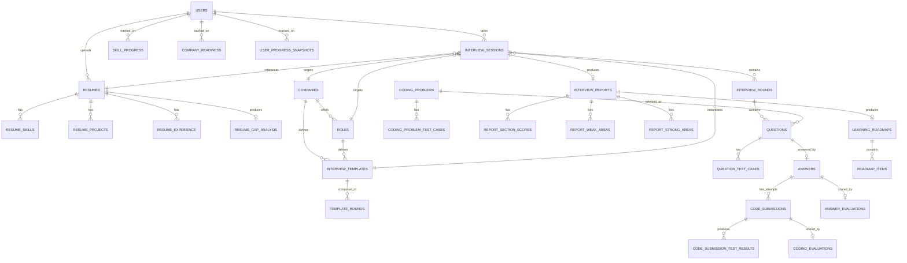

# InterviewIQ AI — Database Schema

Status: **Module 1 — locked pending final consistency pass**
Owner: Database module (Module 1)

Schema for PostgreSQL (system of record). Redis and ChromaDB usage are documented at the bottom — they hold derived/cache/vector data, never the source of truth for anything in this document.

See [Architecture.md](Architecture.md) for the domains this schema implements.

---

## 0. Conventions

- Primary keys: `UUID` (`gen_random_uuid()`), not serial ints.
- Every table has `created_at timestamptz default now()`. Tables mutated after creation also get `updated_at`.
- Enums implemented as Postgres `ENUM` types, named `<table>_<column>_enum`.
- Foreign keys `ON DELETE CASCADE` only where the child has no meaning without the parent. Everywhere else, `ON DELETE RESTRICT`.
- No soft-delete by default — only `users` gets `deleted_at`. Interview history is a permanent record, not user-editable.
- **All scores are `numeric(5,2)` on a 0–100 scale.** Every score column is paired with a `..._explanation text not null` column, or lives in a table whose sole purpose is score+explanation pairs. No bare numeric score is ever stored without its explanation.

---

## 1. Entity Relationship Overview

---

## 2. Auth Domain

### `users`

| Column | Type | Constraints |
|---|---|---|
| id | uuid | PK |
| email | text | unique, not null |
| password_hash | text | nullable (null if OAuth-only account) |
| full_name | text | not null |
| avatar_url | text | nullable |
| auth_provider | enum(`local`,`google`) | not null |
| google_id | text | unique, nullable |
| role | enum(`candidate`,`recruiter`,`admin`) | not null, default `candidate` |
| is_active | boolean | not null, default true |
| is_verified | boolean | not null, default false |
| deleted_at | timestamptz | nullable |
| created_at | timestamptz | not null |
| updated_at | timestamptz | not null |

### `refresh_tokens`

| Column | Type | Constraints |
|---|---|---|
| id | uuid | PK |
| user_id | uuid | FK → users.id, cascade |
| token_hash | text | not null, unique |
| expires_at | timestamptz | not null |
| revoked_at | timestamptz | nullable |
| created_at | timestamptz | not null |

Index: `(user_id)`, `(token_hash)`.

---

## 3. Resume Domain

**Updated in Module 3 (Resume Intelligence) — additively.** Every column below marked "Module 3" was added by `alembic/versions/cadc0c718f96_resume_intelligence.py` on top of Module 1's baseline; nothing pre-existing was dropped, renamed, or narrowed. See [backend/README.md](../backend/README.md) for the pipeline this schema backs.

### `resumes`

| Column | Type | Constraints |
|---|---|---|
| id | uuid | PK |
| user_id | uuid | FK → users.id, cascade |
| file_url | text | not null — a `ResumeStorage` logical key (e.g. `local` backend's relative path), never an absolute filesystem path or anything returned to a client |
| original_filename | text | not null — client-supplied, sanitized for display only; never used to derive a storage path |
| parsed_status | enum(`pending`,`processing`,`done`,`failed`) | not null, default `pending` — `processing` covers both the extraction and AI-analysis sub-stages; which one is communicated via `processing_error` on failure, not a separate enum value |
| raw_text | text | nullable |
| is_active | boolean | not null, default `true` — *(Module 3)* exactly one `true` row per `user_id`, enforced by the partial unique index below, not just application logic |
| processing_error | text | nullable — *(Module 3)* human-readable reason, set only when `parsed_status = failed` |
| mime_type | text | nullable — *(Module 3)* |
| file_size_bytes | int | nullable — *(Module 3)* |
| content_sha256 | text | nullable — *(Module 3)* |
| detected_sections | jsonb | not null, default `{}` — *(Module 3)* raw text split per detected section (Summary/Skills/Experience/...), kept separate from the structured tables below |
| candidate_name | text | nullable — *(Module 3)* |
| professional_summary | text | nullable — *(Module 3)* |
| embeddings_indexed_at | timestamptz | nullable — *(Module 3)* set once `resume_embeddings` (§9) indexing succeeds; null if indexing hasn't run or failed (best-effort, never blocks `parsed_status = done`) |
| created_at | timestamptz | not null |

Index: `(user_id)`. Partial unique index *(Module 3)*: `(user_id) WHERE is_active` — "at most one active resume per user."

### `resume_skills`

| Column | Type | Constraints |
|---|---|---|
| id | uuid | PK |
| resume_id | uuid | FK → resumes.id, cascade |
| skill_name | text | not null — canonical/normalized name (e.g. "PostgreSQL"), what the rest of the app queries by |
| proficiency_hint | enum(`beginner`,`intermediate`,`advanced`) | nullable |
| source | enum(`explicit`,`inferred`) | not null |
| category | enum(`programming_language`,`framework`,`database`,`cloud`,`ai_ml`,`developer_tool`,`other`) | nullable — *(Module 3)* |
| raw_text | text | nullable — *(Module 3)* as detected before normalization (e.g. "JS") |
| evidence_text | text | nullable — *(Module 3)* resume fragment this skill was extracted from |
| confidence | numeric(5,2) | nullable — *(Module 3)* |

Index: `(resume_id)`, `(skill_name)`.

### `resume_projects`

| Column | Type | Constraints |
|---|---|---|
| id | uuid | PK |
| resume_id | uuid | FK → resumes.id, cascade |
| title | text | not null |
| description | text | nullable |
| technologies | jsonb | not null, default `[]` |
| start_date | date | nullable |
| end_date | date | nullable |
| responsibilities | jsonb | not null, default `[]` — *(Module 3)* |
| outcomes | jsonb | not null, default `[]` — *(Module 3)* measurable outcomes, only when explicitly stated on the resume |
| evidence_text | text | nullable — *(Module 3)* |

### `resume_experience`

| Column | Type | Constraints |
|---|---|---|
| id | uuid | PK |
| resume_id | uuid | FK → resumes.id, cascade |
| company | text | not null |
| title | text | not null |
| description | text | nullable |
| start_date | date | nullable |
| end_date | date | nullable |
| technologies | jsonb | not null, default `[]` — *(Module 3)* |
| responsibilities | jsonb | not null, default `[]` — *(Module 3)* |
| evidence_text | text | nullable — *(Module 3)* |

### `resume_education` *(Module 3 — new table)*

Not part of Module 1's original schema (which had no education entity at all).

| Column | Type | Constraints |
|---|---|---|
| id | uuid | PK |
| resume_id | uuid | FK → resumes.id, cascade |
| institution | text | not null |
| degree | text | nullable |
| field_of_study | text | nullable |
| start_date | date | nullable |
| end_date | date | nullable |
| evidence_text | text | nullable |

Index: `(resume_id)`.

### `resume_certifications` / `resume_achievements` *(Module 3 — new tables)*

| Column | Type | Constraints |
|---|---|---|
| id | uuid | PK |
| resume_id | uuid | FK → resumes.id, cascade |
| name (`resume_certifications`) / description (`resume_achievements`) | text | not null |
| issuer | text | nullable — `resume_certifications` only |
| issued_date | date | nullable — `resume_certifications` only |
| evidence_text | text | nullable |

Index: `(resume_id)` on each.

### `resume_gap_analysis`

Role-readiness + explainable interview-difficulty recommendation (module 3 §11–§12). At most one row per resume by design (see the ER diagram in §1) — a new `POST /resumes/{id}/gap-analysis` call *replaces* this row rather than adding another one.

| Column | Type | Constraints |
|---|---|---|
| id | uuid | PK |
| resume_id | uuid | FK → resumes.id, cascade, **unique** |
| target_role_id | uuid | FK → roles.id, `ON DELETE SET NULL`, nullable — **still unresolved**: Module 4 now seeds `roles`, but `POST /resumes/{id}/gap-analysis` (Module 3, unchanged) continues to accept `role_key` only and never populates this column. Left as a known open thread rather than silently wired up, since resolving it is a Module 3 change outside Module 4's scope. |
| role_key | text | nullable — *(Module 3)* internal InterviewIQ competency-profile key (e.g. `backend_engineer`) used while `target_role_id` is unset |
| missing_skills | jsonb | not null, default `[]` |
| matching_skills | jsonb | not null, default `[]` — *(Module 3)* |
| strengths | jsonb | not null, default `[]` — *(Module 3)* nice-to-have skills the candidate already has |
| focus_areas | jsonb | not null, default `[]` — *(Module 3)* |
| recommended_difficulty | enum(`easy`,`medium`,`hard`) | not null — surfaced to the candidate as Beginner/Intermediate/Advanced |
| difficulty_reasons | jsonb | not null, default `[]` — *(Module 3)* the explainable signals behind `recommended_difficulty` — never a bare LLM guess |
| confidence | numeric(5,2) | nullable — *(Module 3)* |
| explanation | text | nullable — *(Module 3)* |
| generated_at | timestamptz | not null |

---

## 4. Interview Planning Domain

**Status: implemented in Module 4.** These four tables were created empty (unused) by Module 1's initial migration; Module 4's migration (`7463f2f331f1_interview_planner`) is purely additive on top of them — new columns only, nothing dropped/renamed/narrowed except relaxing `interview_sessions.resume_id` to nullable (see §5). Seeded via `app/services/planning/data/catalog.json` + `app/db/seed_catalog.py` (idempotent upsert by natural key — safe to run repeatedly), not via migration data.

### `companies`

| Column | Type | Constraints |
|---|---|---|
| id | uuid | PK |
| name | text | not null |
| slug | text | unique, not null — also serves as the stable catalog "key" |
| logo_url | text | nullable |
| interview_style_notes | text | nullable — grounding context fed to the future Question Generator Agent. **These are InterviewIQ preparation profiles based on public/general interview patterns, never a claim to reproduce a real company's actual/confidential process** — enforced by seed-data content, not a schema constraint. |
| is_active | boolean | not null, default true — *(Module 4)* excluded from catalog listings and rejected as a plan target when false, without deleting history existing templates/sessions still reference |
| created_at | timestamptz | not null |

### `roles`

| Column | Type | Constraints |
|---|---|---|
| id | uuid | PK |
| company_id | uuid | FK → companies.id, `ON DELETE SET NULL`, nullable (null = generic/company-agnostic role) |
| title | text | not null |
| level | enum(`intern`,`junior`,`mid`,`senior`,`staff`) | not null |
| description | text | nullable |
| role_key | text | nullable, indexed — *(Module 4)* the canonical link back to Module 3's internal competency-profile taxonomy (`app/services/resume/data/role_profiles.json` — `software_engineer`, `backend_engineer`, `ai_engineer`, `ml_engineer`, `data_engineer`). One taxonomy, not two: AUTO difficulty and personalization both key off this instead of re-deriving a role identity from `title`. |
| is_active | boolean | not null, default true — *(Module 4)* same semantics as `companies.is_active` |

**Known pre-Module-4 gap:** unlike every other table in this document, `roles` (and `template_rounds` below) has no `created_at`, contradicting §0's "every table has `created_at`" convention. This predates Module 4 — both tables were created this way by Module 1's initial migration — and is left as-is rather than altered, since it doesn't block any Module 4 functionality and touching Module 1's already-approved baseline tables is out of this module's scope.

### `interview_templates`

A named, reusable round plan. A single (company, role) pair can have multiple templates (e.g. "Google SWE — Onsite Loop" vs "Google SWE — Phone Screen"), which is the flexibility explicitly required for company-specific templates.

| Column | Type | Constraints |
|---|---|---|
| id | uuid | PK |
| company_id | uuid | FK → companies.id, `ON DELETE SET NULL`, nullable |
| role_id | uuid | FK → roles.id, restrict, not null |
| name | text | not null — e.g. "Onsite Loop", "Phone Screen" |
| description | text | nullable |
| default_difficulty | enum(`easy`,`medium`,`hard`) | not null |
| mode | enum(`full_mock`,`technical_only`,`coding_only`,`behavioral_only`,`resume_deep_dive`) | not null, default `full_mock` — *(Module 4)* which candidate-facing mode this named round plan represents; a plan request either inherits this or must match it exactly, so round selection stays entirely data-driven (never re-filtered dynamically by a future agent) |
| is_active | boolean | not null, default true |
| created_at | timestamptz | not null |

### `template_rounds`

Normalized round plan — replaces the earlier `rounds jsonb` design. Each row is one round slot in a template.

| Column | Type | Constraints |
|---|---|---|
| id | uuid | PK |
| template_id | uuid | FK → interview_templates.id, cascade |
| round_type | enum(`introduction`,`technical`,`coding`,`behavioral`,`system_design`,`resume_discussion`,`final`) | not null |
| sequence_no | int | not null |
| weight | numeric(4,2) | not null — contribution to overall score, e.g. `0.30` |
| is_required | boolean | not null, default true |
| difficulty_override | enum(`easy`,`medium`,`hard`) | nullable — overrides template default for this round only |

Unique: `(template_id, sequence_no)`. Index: `(template_id, round_type)` — supports "which templates include a coding round" queries. See the `roles` section above for the missing-`created_at` note, which applies here too.

---

## 5. Interview Execution Domain

### `interview_sessions`

The aggregate root for a single interview attempt. **Planning fields (everything through `plan_snapshot`) are implemented in Module 4; execution fields (`current_round_sequence`, `current_question_id`, `started_at`, `completed_at`, and every status beyond `not_started`) are implemented in Module 5.**

| Column | Type | Constraints |
|---|---|---|
| id | uuid | PK |
| user_id | uuid | FK → users.id, restrict |
| resume_id | uuid | FK → resumes.id, restrict, **nullable** — *(Module 4)* relaxed from Module 1's original not-null: a generic (non-resume-discussion) mode may be planned with no resume at all. Pins the exact resume row/version used; Module 3 resumes are never mutated after `parsed_status=done` (only `is_active` toggles), so this FK alone is sufficient for reproducibility. |
| company_id | uuid | FK → companies.id, `ON DELETE SET NULL`, nullable |
| role_id | uuid | FK → roles.id, restrict, not null |
| template_id | uuid | FK → interview_templates.id, restrict |
| status | enum(`not_started`,`in_progress`,`completed`,`abandoned`) | not null, default `not_started` |
| current_round_sequence | int | not null, default 0 |
| current_difficulty | enum(`easy`,`medium`,`hard`) | not null — the *dynamic* difficulty; set equal to `starting_difficulty` at plan time, mutated only by Module 5's future Difficulty Agent |
| requested_difficulty | enum(`easy`,`medium`,`hard`,`auto`) | not null, default `auto` — *(Module 4)* what the candidate actually asked for, persisted verbatim regardless of what it resolved to |
| starting_difficulty | enum(`easy`,`medium`,`hard`) | not null — *(Module 4)* the resolved starting difficulty at plan time: `requested_difficulty` as-is if explicit, or the deterministic AUTO resolution if `requested_difficulty=auto`. Immutable after creation — distinct from `current_difficulty`, which Module 5 will mutate. |
| mode | enum(`full_mock`,`technical_only`,`coding_only`,`behavioral_only`,`resume_deep_dive`) | not null, default `full_mock` — *(Module 4)* inherited from (and, if the plan request specified one, validated against) `interview_templates.mode` at plan time |
| plan_snapshot | jsonb | not null, default `{}` — *(Module 4)* the immutable plan snapshot (see the design note below) |
| langgraph_thread_id | text | unique, not null — links to LangGraph checkpoint. Module 4 assigns a `planned:<uuid>` placeholder at plan time (satisfies the NOT NULL/unique constraint for a session that has been planned but not started); *(Module 5)* `InterviewExecutionService.start_interview()` assigns the real `interview:<session_id>:<uuid>` thread id when the interview actually starts — this is the key LangGraph's own checkpoint tables (see §5.x below) are keyed by. |
| started_at | timestamptz | nullable — *(Module 5)* set when `/start` succeeds |
| completed_at | timestamptz | nullable — *(Module 5)* set when the interview reaches `completed` or `abandoned` |
| current_question_id | uuid | FK → questions.id, `ON DELETE SET NULL`, nullable — *(Module 5)* explicit pointer to the pending turn's question. `None` before `/start` and again once the interview is `completed`/`abandoned`. Exists so `/current-turn` and resuming after an interruption are a single indexed read rather than a derived "question with no answer yet" query — this is Postgres, not the LangGraph checkpoint, providing the "come back later without losing the interview" guarantee (module §5, §6). |
| created_at | timestamptz | not null |

Index: `(user_id, status)` for dashboard "in-progress interviews" queries.

**`plan_snapshot` design note (Module 4):** round order/weights/planned-difficulty stay normalized in `interview_rounds` below (queryable, matches this document's pre-existing snapshot pattern there) — `plan_snapshot` only carries what would otherwise require re-joining mutable `companies`/`roles`/`interview_templates`/resume tables to redisplay a plan that must never silently change: denormalized company/role/template labels, the resolved-difficulty reasons, and (for resume-aware plans) a resume-derived personalization block — canonical skills, focus areas, matching/missing skills, project titles, and up to 20 evidence snippets, deliberately capped so the snapshot stays a compact record rather than a copy of the whole resume (the full resume data still lives on the `resume_id` row itself). No raw resume text or contact info ever enters this column. This hybrid (normalized rounds + JSONB label/personalization snapshot) was chosen over either extreme — a single `rounds jsonb` blob would lose the per-round-type query support this document's Decisions Log already committed to for `template_rounds`; fully normalizing the label/personalization data would mean adding several more snapshot tables for data that is only ever read back whole, never queried by field.

`app/services/interview/execution_context.py::build_execution_context()` is the one function allowed to read `plan_snapshot` + `interview_rounds` to build `InterviewExecutionContext` — the sole Module 4 → Module 5 contract (module §19). It never re-queries `companies`/`roles`/`interview_templates`/`resumes` live, which is what makes the snapshot's immutability guarantee actually hold for whatever LangGraph agent consumes it.

### `interview_rounds`

One row per round *instance* within a session. `weight` and `planned_difficulty` are **snapshotted** from `template_rounds` at session-creation time — if the template is edited later, past sessions' reports must not silently change. *(Module 5)* `status` transitions `pending → active → completed` as the engine progresses; a `coding` round is transitioned straight to `skipped` (never executed/faked — Module 6 territory, module §7/§15) rather than left `pending` forever.

| Column | Type | Constraints |
|---|---|---|
| id | uuid | PK |
| session_id | uuid | FK → interview_sessions.id, cascade |
| template_round_id | uuid | FK → template_rounds.id, restrict — traceability back to the plan |
| round_type | enum(same as template_rounds) | not null |
| sequence_no | int | not null |
| weight | numeric(4,2) | not null — snapshot copy |
| planned_difficulty | enum(`easy`,`medium`,`hard`) | not null — snapshot copy |
| status | enum(`pending`,`active`,`completed`,`skipped`) | not null, default `pending` |
| started_at | timestamptz | nullable |
| completed_at | timestamptz | nullable |

Unique: `(session_id, sequence_no)`.

### `questions`

**Status: implemented in Module 5 (text rounds), extended in Module 6 (coding rounds)** (`reference_answer`/`vector_ref`/`source=bank` remain unused for text rounds — no question bank or Knowledge Agent RAG retrieval yet, see backend/README.md's Module 5 "Known limitations"; every Module 5 question has `source=generated`). A coding question, by contrast, always has `source=bank` (it's a deterministic catalog pick, never LLM-generated — module §8) and populates `coding_problem_id`/`coding_snapshot`.

| Column | Type | Constraints |
|---|---|---|
| id | uuid | PK |
| round_id | uuid | FK → interview_rounds.id, cascade |
| topic | text | not null |
| difficulty | enum(`easy`,`medium`,`hard`) | not null |
| question_text | text | not null — for `question_type=coding`, the catalog problem's `description` |
| question_type | enum(`mcq`,`open`,`coding`,`system_design`) | not null — Module 5 writes `open`/`system_design`; Module 6 adds real `coding` rows (never `mcq`) |
| reference_answer | text | nullable — from Knowledge Agent retrieval, used only for evaluation grounding |
| source | enum(`bank`,`generated`) | not null |
| vector_ref | text | nullable — ChromaDB doc id if sourced from `question_bank` |
| asked_at | timestamptz | not null |
| parent_question_id | uuid | FK → questions.id, `ON DELETE SET NULL`, nullable — *(Module 5)* self-referential; set when this question is a follow-up (Interview Agent, module §8) to the question named here. `null` for a fresh, round-opening question (Question Generator Agent) and always `null` for a coding question (coding questions never have follow-ups, module §8). Chains can be more than one level deep (a follow-up can itself be followed up, capped by `MAX_FOLLOW_UPS_PER_QUESTION`, `app/agents/policy.py`) — root-question identity for round-length/duplicate-tracking purposes is found by walking this chain, not stored redundantly. |
| coding_problem_id | uuid | FK → coding_problems.id, `ON DELETE RESTRICT`, nullable — *(Module 6)* which catalog problem this is a snapshot of. `null` for every non-coding question. RESTRICT mirrors `interview_rounds.template_round_id`: a catalog problem already asked in a live interview can be deactivated but never deleted out from under that history. |
| coding_snapshot | jsonb | nullable — *(Module 6)* the catalog problem's remaining content (`title`, `constraints`, `expected_time_complexity`, `expected_space_complexity`, `supported_languages`, `starter_code`, `topics`) captured **at selection time**, immune to later catalog edits — the same "catalog is mutable, live instances are immutable copies" rule `interview_sessions.plan_snapshot` already established. `null` for every non-coding question. |

Indexes: `(round_id)`, `(coding_problem_id)`. Creates a circular FK reference across `interview_sessions.current_question_id` → `questions` → `interview_rounds` → `interview_sessions` — intentional and safe (both new FKs are nullable with `ON DELETE SET NULL`; see `4df563d9a10b_interview_execution.py`'s docstring).

### `coding_problems` / `coding_problem_test_cases` *(Module 6 — new tables)*

The coding-problem **catalog** — maintainable, seed-driven data (`app/services/coding/data/coding_problems.json` + `catalog_seed.py`'s idempotent upsert, module §8's "do not hardcode coding problems directly inside service methods"), mirroring `interview_templates`/`template_rounds`'s shape and seeding pattern exactly. Selecting a problem for a round never points a live `Question` at these rows directly — it SNAPSHOTS the content into `Question`/`question_test_cases` (see above), so editing this catalog never changes a question a candidate has already been asked.

**`coding_problems`**

| Column | Type | Constraints |
|---|---|---|
| id | uuid | PK |
| slug | text | unique, indexed — natural key for idempotent seeding, never exposed to clients as "the" id |
| title | text | not null |
| description | text | not null — the full problem statement |
| difficulty | enum(`easy`,`medium`,`hard`) | not null |
| topics | jsonb | not null, default `[]` — free-form tags (arrays, hash_maps, binary_search, stacks_queues, trees, graphs, dynamic_programming, strings, ...); catalog labels, not something code branches on |
| constraints | text | nullable |
| expected_time_complexity | text | nullable |
| expected_space_complexity | text | nullable |
| supported_languages | jsonb | not null, default `[]` — e.g. `["python","java","cpp"]`; must be a subset of the execution worker's configured languages |
| starter_code | jsonb | not null, default `{}` — `{language: scaffold}`, optional per-language I/O scaffolding, never a working solution |
| role_keys | jsonb | not null, default `[]` — optional role-priority metadata (same taxonomy as `app/services/resume/role_profiles.json`); empty matches every role |
| is_active | boolean | not null, default `true` |
| created_at | timestamptz | not null |

**`coding_problem_test_cases`**

| Column | Type | Constraints |
|---|---|---|
| id | uuid | PK |
| problem_id | uuid | FK → coding_problems.id, cascade |
| input | text | not null |
| expected_output | text | not null |
| is_sample | boolean | not null, default `false` |
| weight | numeric(4,2) | not null, default `1.00` |
| sequence_no | int | not null |

Unique: `(problem_id, sequence_no)`. Indexed: `(problem_id)`.

### `question_test_cases`

Only populated for `question_type = coding` — the **live, snapshotted** copy of a `coding_problem_test_cases` row at the moment a problem was selected for a round (never a live reference back to the catalog). Backs the real execution engine — this is what `CodeExecutor` runs the candidate's code against. Hidden (`is_sample=false`) rows are never exposed via any API response (module §8) — only their aggregate pass/fail counts are.

| Column | Type | Constraints |
|---|---|---|
| id | uuid | PK |
| question_id | uuid | FK → questions.id, cascade |
| input | text | not null |
| expected_output | text | not null |
| is_sample | boolean | not null, default false — sample cases are shown to the candidate, hidden ones are not |
| weight | numeric(4,2) | not null, default `1.00` — contribution to correctness_score |
| sequence_no | int | not null |

Unique: `(question_id, sequence_no)`.

### `answers`

**Status: implemented in Module 5** (text rounds only — `code_submissions` below remains Module 6). One per question — for coding questions this holds the candidate's verbal/text approach explanation (if any); the code itself lives in `code_submissions`.

| Column | Type | Constraints |
|---|---|---|
| id | uuid | PK |
| question_id | uuid | FK → questions.id, cascade, unique |
| answer_text | text | nullable |
| response_time_seconds | int | nullable |
| submitted_at | timestamptz | not null |

### `code_submissions`

**Status: implemented in Module 6.** One row per **attempt**, not per question — a candidate may "Run" against sample test cases any number of times before the one "Submit" that counts. `is_final` marks that one graded attempt.

| Column | Type | Constraints |
|---|---|---|
| id | uuid | PK |
| answer_id | uuid | FK → answers.id, cascade |
| attempt_no | int | not null — 1, 2, 3... per answer, assigned server-side |
| is_final | boolean | not null, default false — see the "release on infra failure" note below; this is not simply write-once |
| language | text | not null |
| source_code | text | not null |
| execution_status | enum(`queued`,`running`,`success`,`partial`,`error`,`timeout`,`compile_error`,`runtime_error`,`memory_limit`,`output_limit`) | not null, default `queued` — the last 4 values are Module 6 additions (granular failure reasons); `timeout`/`error` are reused as-is for the "TIME_LIMIT"/"EXECUTION_ERROR" concepts rather than adding near-duplicate values (see `app/models/enums.py::CodeExecutionStatus`'s docstring for the full mapping) |
| executor | text | nullable — e.g. `docker_sandbox_v1`, `judge0`, for audit/debugging (not currently populated — the executor identity is implied by config, not written per-row) |
| passed_test_count | int | nullable — populated once executed; unweighted count |
| total_test_count | int | nullable |
| total_runtime_ms | int | nullable |
| peak_memory_kb | int | nullable — not populated by the MVP sandbox (memory isn't measured per-execution, only limited — see backend/README.md's Module 6 "Known limitations") |
| error_message | text | nullable — *(Module 6)* the compiler's own message (`compile_error`) or a genuine sandbox/evaluation-provider infra failure message; `null` for every other outcome (wrong-answer/runtime detail already lives per-test in `code_submission_test_results.stderr`) |
| created_at | timestamptz | not null |
| graded_at | timestamptz | nullable — set only when `is_final = true` and full evaluation has run |

Unique: `(answer_id, attempt_no)`. Partial unique index `(answer_id) WHERE is_final` — at most one final attempt per answer, enforced by the DB, not just application logic (the real backstop for concurrent Submit requests, module §22).

**Scope of execution differs by attempt type:**
- `is_final = false` ("Run"): executes only against `question_test_cases WHERE is_sample = true`. No `coding_evaluations` row is produced — execution only, no LLM call. This keeps iterative testing fast and free of LLM cost.
- `is_final = true` ("Submit"): executes against **all** test cases (sample + hidden), and is the only attempt that produces a `coding_evaluations` row.

**`is_final` can be released back to `false`** (Module 6, `CodingRoundService._release_final_slot_on_infra_failure`) — but *only* when grading never reached a genuine verdict because OUR infrastructure failed (the sandbox was unreachable, or the code-evaluation LLM call failed), freeing the partial-unique slot so the candidate can submit again. A candidate outcome that genuinely ran — success, partial, a compile error, a runtime error, a timeout — is always a final, graded verdict and never triggers this; only `execution_status=error` (a bare infra failure, distinct from every candidate-caused status) ever does.

### `code_submission_test_results`

Per-test-case execution detail — the deterministic evidence behind `coding_evaluations.correctness_score`.

| Column | Type | Constraints |
|---|---|---|
| id | uuid | PK |
| code_submission_id | uuid | FK → code_submissions.id, cascade |
| test_case_id | uuid | FK → question_test_cases.id, restrict |
| passed | boolean | not null |
| actual_output | text | nullable |
| runtime_ms | int | nullable |
| memory_kb | int | nullable |
| stderr | text | nullable |

Unique: `(code_submission_id, test_case_id)`.

---

## 6. Evaluation Domain

### `answer_evaluations`

**Status: implemented in Module 5** (text rounds only — `coding_evaluations` below remains Module 6). Produced by the Evaluation Agent (technical, problem_solving) and Communication Agent (communication, confidence) for **every** answer, coding included — a coding question's verbal approach explanation is evaluated here independently of its code. `difficulty_signal` is a pure function of `technical_score`/`problem_solving_score` (`app/agents/policy.py::compute_difficulty_signal` — `>=80` increase, `<=40` decrease, else maintain; never LLM-decided, module §12) — stored here for audit even though the *effect* of the signal (the new `interview_sessions.current_difficulty`) is what the next question actually reads.

| Column | Type | Constraints |
|---|---|---|
| id | uuid | PK |
| answer_id | uuid | FK → answers.id, cascade, unique |
| technical_score | numeric(5,2) | not null — 0–100 |
| technical_explanation | text | not null |
| problem_solving_score | numeric(5,2) | not null |
| problem_solving_explanation | text | not null |
| communication_score | numeric(5,2) | not null |
| communication_explanation | text | not null |
| confidence_score | numeric(5,2) | not null |
| confidence_explanation | text | not null |
| difficulty_signal | enum(`increase`,`decrease`,`maintain`) | not null — Difficulty Agent's decision, stored for audit/analytics |
| created_at | timestamptz | not null |

### `coding_evaluations`

**Status: implemented in Module 6.** Produced from the **final** (`is_final = true`) `code_submission` only — non-final "Run" attempts are never evaluated, and a `compile_error` final submission gets a deterministic zero-evaluation row with no LLM call at all (there's no code behavior to judge quality of). `correctness_score` is **computed from `code_submission_test_results`, not LLM-guessed** — see [Architecture.md](Architecture.md) §5.4. `readability_score`/`optimization_score`/`edge_case_score` are the only LLM judgments (`CodeEvaluationProvider`, `app/services/code_evaluation/`) — the model is never asked about and never permitted to override correctness.

| Column | Type | Constraints |
|---|---|---|
| id | uuid | PK |
| code_submission_id | uuid | FK → code_submissions.id, cascade, unique |
| correctness_score | numeric(5,2) | not null — weighted test pass rate × 100 (weighted by `question_test_cases.weight`, distinct from the unweighted `passed_test_count`/`total_test_count` on `code_submissions`) |
| correctness_explanation | text | not null — a deterministic pass/fail-count sentence, not an LLM narrative |
| time_complexity | text | nullable — the LLM's own Big-O estimate of the submitted approach, e.g. `O(n log n)`, descriptive, not a score |
| space_complexity | text | nullable |
| readability_score | numeric(5,2) | not null — LLM judgment: naming, structure, formatting, clarity |
| readability_explanation | text | not null |
| optimization_score | numeric(5,2) | not null — LLM judgment: efficiency of the chosen approach relative to what the problem requires |
| optimization_explanation | text | not null |
| edge_case_score | numeric(5,2) | not null — *(Module 6)* LLM judgment: does the code's own logic handle empty input, boundary values, duplicates, etc. — judged from reading the code, never from which hidden tests happened to be included |
| edge_case_explanation | text | not null |
| overall_code_score | numeric(5,2) | not null — *(Module 6)* **deterministic** weighted combination of the five scores above (`app/agents/policy.py::compute_overall_code_score` — correctness 0.40, optimization 0.20, readability 0.15, edge_case 0.15, quality 0.10 reusing readability; module §11's "don't let the model freely decide the headline number", the same reasoning `answer_evaluations.difficulty_signal`'s policy uses) — never LLM-set |
| strengths | jsonb | not null, default `[]` — *(Module 6)* concrete, specific strengths; empty when there are none, never invented |
| weaknesses | jsonb | not null, default `[]` — *(Module 6)* |
| recommendations | jsonb | not null, default `[]` — *(Module 6)* concrete, actionable suggestions for this exact submission |
| created_at | timestamptz | not null |

No chain-of-thought ever crosses into any column here (module §20) — every LLM-authored field is a score, a short evidence-citing explanation, or a structured list, never the model's internal reasoning.

---

## 7. Report Domain

### `interview_reports`

| Column | Type | Constraints |
|---|---|---|
| id | uuid | PK |
| session_id | uuid | FK → interview_sessions.id, cascade, unique |
| overall_score | numeric(5,2) | not null — see Score Aggregation below |
| overall_explanation | text | not null |
| summary_text | text | not null |
| generated_at | timestamptz | not null |

**Score aggregation (default formula, tunable in Module 7):**
- `report_section_scores` (per dimension: technical, coding, communication, problem_solving, confidence) = plain average of that dimension's score across every `answer_evaluations`/`coding_evaluations` row in the session. This is a diagnostic breakdown, independent of round weighting.
- `overall_score` = weighted average of **per-round composite scores**, weighted by each round's `interview_rounds.weight` (the snapshotted template weight): for each round, average the dimension scores produced by answers/submissions within that round, then combine rounds using their weight. This is what actually uses the `weight` column — the two aggregations serve different purposes (section scores diagnose *what* to improve, `overall_score` reflects the round plan's *intended* emphasis).

### `report_section_scores`

Normalized instead of one wide row — a report has no `coding` row at all if the session had no coding round, rather than a nullable column. Also means adding a 6th section later needs no migration.

| Column | Type | Constraints |
|---|---|---|
| id | uuid | PK |
| report_id | uuid | FK → interview_reports.id, cascade |
| section | enum(`technical`,`coding`,`communication`,`problem_solving`,`confidence`) | not null |
| score | numeric(5,2) | not null |
| explanation | text | not null |

Unique: `(report_id, section)`.

### `report_weak_areas` / `report_strong_areas`

| Column | Type | Constraints |
|---|---|---|
| id | uuid | PK |
| report_id | uuid | FK → interview_reports.id, cascade |
| topic | text | not null |
| severity | enum(`low`,`medium`,`high`) | only on weak_areas |
| evidence_text | text | not null — quoted/paraphrased from the actual answer that triggered this |

### `learning_roadmaps`

| Column | Type | Constraints |
|---|---|---|
| id | uuid | PK |
| report_id | uuid | FK → interview_reports.id, cascade, unique |
| generated_at | timestamptz | not null |

### `roadmap_items`

| Column | Type | Constraints |
|---|---|---|
| id | uuid | PK |
| roadmap_id | uuid | FK → learning_roadmaps.id, cascade |
| topic | text | not null |
| resource_title | text | not null |
| resource_url | text | nullable |
| resource_type | enum(`article`,`video`,`course`,`practice`) | not null |
| priority | int | not null |
| is_completed | boolean | not null, default false |
| sequence_no | int | not null |

---

## 8. Progress Domain

### `skill_progress`

| Column | Type | Constraints |
|---|---|---|
| id | uuid | PK |
| user_id | uuid | FK → users.id, cascade |
| skill_name | text | not null |
| proficiency_score | numeric(5,2) | not null — 0–100 |
| trend | enum(`improving`,`stable`,`declining`) | not null |
| last_assessed_at | timestamptz | not null |
| updated_at | timestamptz | not null |

Unique: `(user_id, skill_name)`.

### `company_readiness`

| Column | Type | Constraints |
|---|---|---|
| id | uuid | PK |
| user_id | uuid | FK → users.id, cascade |
| company_id | uuid | FK → companies.id, cascade |
| readiness_score | numeric(5,2) | not null — 0–100 |
| last_interview_session_id | uuid | FK → interview_sessions.id, nullable |
| updated_at | timestamptz | not null |

Unique: `(user_id, company_id)`.

### `user_progress_snapshots`

Materialized time-series row, written whenever a report is generated.

| Column | Type | Constraints |
|---|---|---|
| id | uuid | PK |
| user_id | uuid | FK → users.id, cascade |
| snapshot_date | date | not null |
| interviews_completed | int | not null |
| avg_overall_score | numeric(5,2) | not null — 0–100 |
| metadata | jsonb | not null, default `{}` |

Unique: `(user_id, snapshot_date)`.

---

## 9. Non-Postgres Stores

### Redis (cache / ephemeral)

| Key pattern | Purpose | TTL |
|---|---|---|
| `session:{id}:hot_state` | Read-through mirror of current turn's LangGraph state, for low-latency polling | duration of session |
| `submission:{id}:status` | Fast poll target for coding submission grading status, mirrors `code_submissions.execution_status` | until graded + short buffer |
| `ratelimit:{user_id}:{route}` | Basic per-user rate limiting | rolling window |
| `email_verify:{token}` | Email verification token | 24h |

Redis is never authoritative — it can be flushed and the system recovers from Postgres. **Deviation (Module 5):** `session:{id}:hot_state` was not implemented — `GET /interview-sessions/{id}/current-turn` reads `interview_sessions.current_question_id` directly (one indexed FK lookup), which is fast enough at MVP scale without a caching layer. Left as a documented future optimization, not a design gap; nothing in Module 5 assumes it exists. **Deviation (Module 6):** `submission:{id}:status` was not implemented either, same reasoning — `GET /interview-sessions/{id}/code-submissions/{id}` reads `code_submissions.execution_status` directly (one indexed PK lookup); Redis is not on the polling path anywhere in this codebase yet.

### ChromaDB (vector store)

| Collection | Contents | Written by | Read by |
|---|---|---|---|
| `question_bank` | Pre-authored questions tagged by company/role/topic/difficulty | seed script | not implemented — Module 5's Question Generator Agent generates every question live instead (`questions.source` is always `generated`, never `bank`) |
| `knowledge_base` | Curated reference material / model answers per topic | seed script | not implemented — Module 5's Knowledge Agent is a deterministic in-process helper (resume evidence + `role_profiles.json` topic hints), not a RAG lookup; see backend/README.md's Module 5 "Known limitations" |
| `resume_embeddings` | Embedded skill/project/experience/certification evidence chunks, one vector per chunk, metadata `{user_id, resume_id, kind, name}` | resume upload pipeline (best-effort, module 3 §14) | not read by anything yet — indexing-only boundary prepared for a future Knowledge Agent upgrade. (Separately, this write path is currently broken against the real Gemini embedding API — a known, unrelated TODO, see backend/README.md.) |

### LangGraph checkpoint tables (Module 5, Postgres-backed but not Alembic-managed)

`checkpoints`, `checkpoint_blobs`, `checkpoint_writes`, `checkpoint_migrations` — created and versioned by `langgraph-checkpoint-postgres` itself (`AsyncPostgresSaver.setup()`, called idempotently from `app/main.py`'s lifespan on every startup), **not** by an Alembic migration; they live in the same Postgres database but are a separate, library-owned schema, per Architecture.md §5.5's original design. Keyed by `thread_id` = `interview_sessions.langgraph_thread_id`. Verified live: querying `checkpoints` after a real multi-turn interview shows one row group per `thread_id` accumulating across turns (confirms LangGraph's Postgres-backed persistence genuinely executes, satisfying Roadmap.md's Module 5 exit criterion "Postgres-backed checkpointing wired end to end").

**Important nuance, documented honestly rather than overclaimed**: `InterviewExecutionService` rebuilds a *complete* `InterviewState` from Postgres on every turn and passes it whole to `graph.ainvoke()`, rather than reading back a partial checkpoint and resuming a specific interrupted node. This means the checkpoint tables are real and populated, but the actual "candidate can stop mid-question and resume later without losing the interview" guarantee (module §5, §6) comes entirely from Postgres (`interview_sessions`/`interview_rounds`/`questions`/`answers`/`answer_evaluations`) plus the idempotent-retry design in `InterviewExecutionService.submit_answer` — not from resuming a specific crashed LangGraph node. The checkpointer is real infrastructure, correctly wired, and available for a future upgrade to node-level resume granularity; it isn't yet the thing making recovery work today.

---

## 10. Decisions Log

| # | Decision | Rationale |
|---|---|---|
| 1 | Scores are `numeric(5,2)`, 0–100 scale, 5 named report sections, every score has a paired explanation column | Matches product's reporting taxonomy end to end, from per-answer evaluation up to the final report |
| 2 | `interview_templates` + `template_rounds` normalized (no jsonb) | Enables multiple named templates per company/role and per-round-type queries |
| 3 | `interview_rounds` snapshots `weight`/`planned_difficulty` from `template_rounds` rather than joining live | Editing a template must never retroactively change a past session's report |
| 4 | Coding correctness is derived from `code_submission_test_results`, stored as a computed score with an LLM-authored explanation — never an LLM-guessed number | Enforces "no LLM-only code evaluation" at the schema level, not just in agent prompts |
| 5 | `report_section_scores` normalized into a child table instead of wide nullable columns | A session without a coding round simply has no `coding` row, instead of a nullable column; adding a 6th section later needs no migration |
| 6 | `code_submissions` is one row per **attempt** (`attempt_no`, `is_final`), not one row per question | Candidates need to test against sample cases before final submit; only the final attempt is graded (executes hidden cases + triggers the Evaluation Agent), which also keeps LLM cost bounded to one evaluation per coding question |
| 7 *(Module 3)* | `resumes.is_active` + a partial unique index (`WHERE is_active`), not a separate "current resume" pointer table | Versioning requires many inactive historical rows per user to coexist; a partial unique index enforces "at most one active" at the DB level without a join |
| 8 *(Module 3)* | `resume_gap_analysis` reused (extended additively) for both gap analysis *and* the interview-level recommendation, instead of a new table | Features.md already scopes both under one entity ("Gap analysis against a target role" / "Recommended starting difficulty from gap analysis"); the ER diagram's `||--o|` cardinality is preserved by a unique constraint on `resume_id`, so a re-request *replaces* the row rather than accumulating history |
| 9 *(Module 3)* | `resume_education`/`resume_certifications`/`resume_achievements` added as new tables rather than jsonb columns on `resumes` | Matches the existing `resume_skills`/`resume_projects`/`resume_experience` pattern — queryable, indexable, and each row carries its own `evidence_text` for provenance |
| 10 *(Module 6)* | `coding_problems`/`coding_problem_test_cases` added as a new catalog, seed-driven like `interview_templates`/`template_rounds` — a coding `Question` SNAPSHOTS the selected problem (`questions.coding_problem_id`/`coding_snapshot` + copied `question_test_cases` rows) rather than holding a live reference to the mutable catalog | Editing the catalog must never retroactively change a problem a candidate has already been asked, mirroring decision #3's reasoning for `interview_rounds` exactly |
| 11 *(Module 6)* | `code_submissions.execution_status` extended additively (`compile_error`/`runtime_error`/`memory_limit`/`output_limit`), reusing the existing `timeout`/`error` values for the TIME_LIMIT/EXECUTION_ERROR concepts instead of adding near-duplicates | A genuinely new, distinguishable outcome gets a new value; a concept the enum already covered doesn't get a second name for it |
| 12 *(Module 6)* | `code_submissions.is_final` can be released back to `false` after being set, exclusively on a genuine sandbox/evaluation-provider infrastructure failure — never on any candidate-caused outcome | The partial unique index enforces "at most one final submission," but an infra outage must not permanently lock a candidate out of ever submitting again for a question it never actually graded |
| 13 *(Module 6)* | `coding_evaluations.overall_code_score` is a deterministic weighted combination of the five sub-scores, computed in application code, never asked of the LLM | Extends decision #4's "no LLM-guessed number" principle from correctness specifically to the headline aggregate score too |

---

*Next: once approved, Module 1 continues with repo scaffolding that matches this schema (Alembic migration for everything above) and the FastAPI/React skeletons from [Architecture.md](Architecture.md) §3.*
